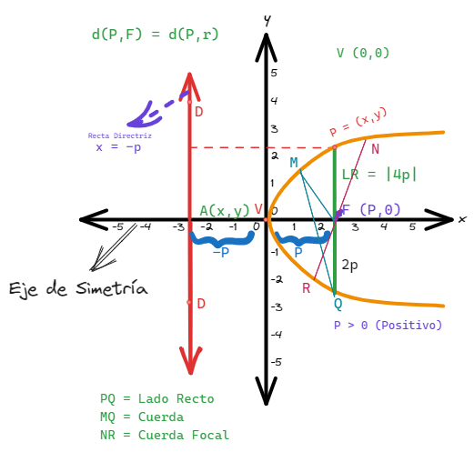

# [[Vectores y Geometria Analitica]]
	- ## Clase
		- ### Parabola
			- Es el conjunto de puntos en el plano que equidistan de una recta fija DD' llamada directriz y de un punto fijo F llamado foco que no pertenece al conjunto
			- 
			- 
		- ### Elementos de la Parabola:
			- Vertice(V): es el punto de interseccion de la parabola con el eje de simetria
			  logseq.order-list-type:: number
			- Foco(F): es el punto fijo, situado sobre el eje de simetria a "P" unidades del vertice
			  logseq.order-list-type:: number
			- Eje de simetria: recta perpendicular a la directriz y que pasa por el vertice y foco
			  logseq.order-list-type:: number
			- Cuerda: un segmento que une dos puntos de la curva
			  logseq.order-list-type:: number
			- Directriz: recta fija, perpendicular al eje de simetria
			  logseq.order-list-type:: number
			- Cuerda focal: segmento que une dos puntos y pasa por el foco.
			  logseq.order-list-type:: number
			- Lado Recto: es una cuerda focal perpendicular al eje de simetria
			  logseq.order-list-type:: number
			- Radio Vector: es un segmento que une el **foco* y un punto cualesquiera de la curva.
			  logseq.order-list-type:: number
		- ### Parabolas con vertice en el origen:
			- Caso 1
				- Vertice (0,0), eje de simetria coincide con el eje x, cuando p es positiva la ecuacion es $$y^2 = 4px$$
				- $$P(x,4)$$
				- $$F(P,0)$$
				- la ecuacion de la recta directriz es $$x = -p$$ cuando es vertical siempre es $$x$$
				- [[draws/2024-09-26-20-51-57.excalidraw]]
				- 
				- 
			- Caso 2
				- Vertice (0,0), cuando la parabola esta a la izquierda la p < 0 (es negativa) entonces la ecuacion es $$y^2 = -4px$$
				- la ecuación de la recta directriz es $$x = p$$ cuando es vertical siempre es $$x$$
				- $$P(x,4)$$
				- $$F(-P,0)$$
				- [[draws/2024-09-28-22-42-29.excalidraw]]
				- 
				- 
			- Caso 3
				- Vertice (0,0), cuando la parabola va hacia arriba la p>0(es posotiva) entonces la ecuacion es $$x^2 = 4px$$
				- la ecuacion de la recta directriz es $$y = -p$$ cuando es horizontal siempre es $$y$$
				- $$F(0,P)$$
				- [[draws/2024-09-29-09-36-03.excalidraw]]
				- 
				- 
			- Caso 4
				- Vertice (0,0), cuando la parabola mira para abajo la p< 0 (es negativa) $$x^2 = -4px$$
				- la ecuacion de la recta directriz es $$y = p$$ cuando es horizontal siempre es $$y$$
				- $$F(0,-P)$$
				- [[draws/2024-09-29-09-51-59.excalidraw]]
				- 
				- 
		- ### Consideraciones :
			- Esta es la definición en síntesis
			- $$d(P,F) = d(P,r)$$
			- vertice es la interseccion entre la curva y el origen (0,0), en realidad donde esta el momento de la simetria
			- el punto puede ser positivo o negativo, no cero o sino ca ir por el eje de simetria
			- el eje de simetria es el eje x en el ejemplo
			- $$(M,Q)$$ en una cuerda, porque de un punto de la parabola a otro forman una recta
			- vértice es el punto de medio entre el foco y un punto medio de la recta
			- en el ejemplo el vector $$\vec{P,Q} = \left| 4P \right| $$
			- el punto foco con un punto cualquiera de la parabola es un radio vector
			- la recta directriz es la recta que esta al lado opuesto a la parabola
			- El lado recto (LR) tiene que se perpendicular al
				- En todos los casos es el modulo de 4
					- $$LR = \left|  4 \right|$$
			- Si no figura el Vertice en el ejercicio es (0,0)
			- El radio vector es el punto Foco hasta un punto en la parabola
		- ### Ejercicios
			- Hallar la ecuación de la parábola que tenga por foco el punto $$$$
			  logseq.order-list-type:: number
				- Si no figura en el ejercicio el vertice es (0,0)
				- el foco (F) y la directriz (x) tienen que ser opuestos
				- la parabola es horizontal , se abre a la izquierda entonces la forma de su ecuacion es $$y^2=-4px$$
				- cuando es horizontal y se abre a la izquierda de dice que el foco es $$F=(-P,0)$$
				- cuando se tiene la ecuacion se grafica
				- #### Solucion:
					- ##### Datos
						- $$-F(\frac{-5}{3},0)$$   $$-l: 3x-5=5$$   $$-V(0,0)$$
					- ##### Formulas
						- $$y^2 = -4px$$
					- ##### Calculos
						- ###### Ecuacion:
							- $$y^2 = -4px$$ $$y^2 = -4\frac{-5}{3} x$$    $$y^2 = \sqrt{\frac{-20}{3}} x$$
						- ###### Directriz
							- $$3x-5 = 0$$ $$3x=5$$ $$x = \frac{5}{3}$$
						- ###### Punto
							- $$+p = \frac{+5}{3}$$
						- ###### Linea Recta
							- $$LR = \left| \right|$$
			- Hallar la ecuacion de la parabola cuyo vertice es el origen, sabiendo que es simetrica respecto al eje $$y$$; y que pasa por el punto $$(4,-8)$$
			  logseq.order-list-type:: number
				- El eje de simetria es el eje y, me da la orientacion de la parabola, el caso 3 porque $$y=p$$,
				- primero se ubica todos los datos que se conoce
				- en este caso se conoce un punto (4,-8) - es un punto de la parabola
				- el punto tiene que ser simetrico con el origen (vertice) que si no dice es el (0,0)
				- si el eje de simetria es el eje y entonces es como un
				- 
				- si el eje de simetria es el eje x
				- 
				-
			- Dada la parabola $$x^2 = 12y$$, determinar (notas: es vertical, concavo hacia arriba su formula es $$x^2 = 4px$$)
			  logseq.order-list-type:: number
				- La coordenada del foco
				  logseq.order-list-type:: number
					- logseq.order-list-type:: number
					  $$F(0,3)$$
				- la ecuacion de la recta directriz
				  logseq.order-list-type:: number
					- logseq.order-list-type:: number
					  $$y = -3$$ $$y+3 = 0$$ ambas formas esta correcto
				- el eje de simetria
				  logseq.order-list-type:: number
					- Eje $$y$$
					  logseq.order-list-type:: number
				- la longirud del lado recto
				  logseq.order-list-type:: number
					- logseq.order-list-type:: number
					  $$LR = \left| 4p \right|$$      $$LR = \left| 4.3 \right|$$ $$LR = \left| 12 \right|$$
				- la longitud del radio vector al punto (-6,3)
				  logseq.order-list-type:: number
					- logseq.order-list-type:: number
				- Graficar
				  logseq.order-list-type:: number
					- valor absoluto son aqui las |4.3| no es modulo de un vector, no se hace al cuadrado
					  logseq.order-list-type:: number