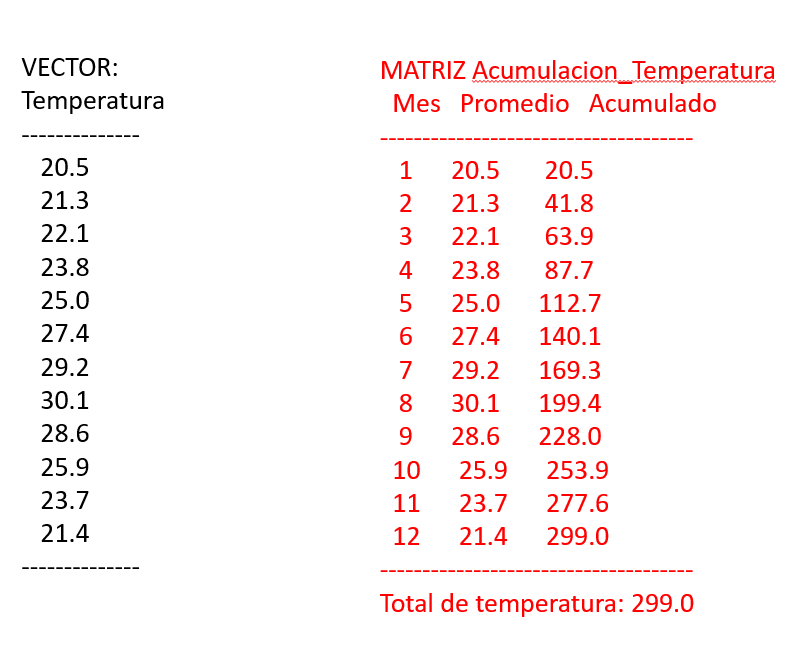

# [[Metodologia de la programacion]]
	- ## Algoritmo de Busqueda con Salida de Ciclo
		- ### Ejercicio 1:
		- Hacer un programa que precargue un vector de 10 Elementos
			- Leer por teclado 1 numero
			- Verificar si el nro existe en el vector
			- Si se encuentra imprimir "Encontrado", mostrar el numero y mostrar la posicion del vector
			- Si no encuentra imprimir "No Encontrado"
			- |Dato|3|5|9|11|15|19|21|23|
			  |Posicion Vector|(0)|(1)|(2)|(3)|(4)|(5)|(6)|(7)|
			- Leer Teclado |15|: Encontrado, 15, Posicion 4
			- #### Ejercicio Resuelto:
				- ```c++
				  #include <iostream>
				  using namespace std;
				  
				  int vector[10] = {10,20,30,40,50,60,70,80,90,100};
				  
				  int main(){
				    int encontrado = 0;
				    int buscar = 0;
				    int posicion = 0;
				    cout<<"Ingrese un valor a buscar en el vector: "<<endl;
				    cin>> buscar;
				    for (int i = 0;i<10;i++){
				      if(vector[i] == buscar){
				  		encontrado = 1; 
				        	posicion = i;
				        	exit;      
				      }
				    }
				    if (encontrado == 1){
				      cout<<"Encontrado el numero, "<<buscar<<", en la posicion "<<posicion<<endl;
				    }
				    return 0;
				  }//version 1
				  ```
				- ```c++
				  #include <iostream>
				  int vector[10] = {10,20,30,40,40,50,60,70,80,90};
				  int main(){
				    int encontrado = 0;  int buscar = 0;  int posicion =0;
				    std::cin>>buscar;
				    for(int i = 0;i<10;i++){
				      if(vector[i]==buscar){
				        encontrado = 1;
				        posicion = i;
				        exit; // se puede usar tambien break; o tambien (i=10) para salir del ciclo
				      }
				    }
				    if(encontrado==1){
				      std::cout<<"Encontrado: "<<buscar<<" "<<posicion;
				    }
				    
				    return 0;
				  }//version hecha por el profesor
				  ```
				-
		- ### Consideraciones:
			- Si se quiere la primera ocurrencia se le pone un break al ciclo
			- Si se quiere la ultima ocurrencia **NO** se le pone break al ciclo
			- Si no se fuerza la salida del ciclo va a tomar la posicion de la busqueda
			- Se puede usar indistintamente para forzar la salida de un ciclo con:
			  collapsed:: true
				- break;
				- i=n (donde n es la ultima posicion del vector)
				- exit;
	- ## Cadena de Caracteres:
		- Lenguaje C:
			- **char** (tiene 8 BIT - 256)
				- Se utiliza para Vectores y Punteros
			- **char cadena**[10] = "Hola Mundo";
			- **char *cadena**;
		- Lenguaje C++:
			- **char**
				- Se utiliza para Vectores y Punteros
			- **string**
				- Se utiliza para Cadenas de Texto (es una clase)
		- #### Ejemplos:
			- ```c++
			  #include <iostream>
			  using namespace std;
			  
			  int main (){
			    char cadena[100] = "Hola Mundo";
			    cout<<cadena<<endl;
			    return 0;
			  }
			  ```
		- ## Consideraciones:
			- Para predefinir el espacio de una cadena de caracteres de la siguiente forma
				- ```c++
				  char cadena[250]
				  char cadena[100]
				  ```
			- Se puede asignar un valor al momento de definir la variable de la siguiente manera
				- ```c++
				  char cadena[250] = "Hola Mundo";
				  char cadena[100] = "Hola Mundo 2";
				  ```
		- ## Definicion de Clase String
			- #### Ejemplo:
				- ```c++
				  #include <iostream>
				  #include <string.h> //
				  using namespace std;
				  int main(){
				    char cadena[100] = "Hola Mundo";
				    string cadena_clase = "Hola Mundo";
				    cout << cadena << endl;
				    
				    //contar cadena al estilo Lenguaje C
				    int contador = 0;
				    while(cadena[contador] != 0){
				      contador++;
				    }// cuando termina el contador va a definir la cantidad de caracteres
				    cout<<"Tiene "<<contador<<" caracteres"<<endl;
				    cout<<"Tiene "<<strlen(cadena)<<" caracteres"<<endl;
				    
				    //obtener longitud de cadena al estilo C++
				    cout<<"Tiene "<<cadena_clase.length()<<" caracteres"<<endl;
				    cout<<"Tiene "<<cadena_clase.size()<<" caracteres"<<endl;
				    
				    
				    return 0;
				  }
				  ```
		- ## Consideraciones:
			- La funcion **strlen()** esta dentro de la libreria **<string.h>**
				- ```c++
				  //contiene el mismo calculo
				  while(cadena[contador] != 0){
				      contador++;
				    }
				  ```
			- Para acceder a cualquier funcion/metodo o variable/atributo se agrega un punto (.)
				- ```c++
				  Alumnos.nombre
				  Alumnos.Venir_A_Clase()
				  ```
	- # Recomendacion
		- Libro Lenguaje C de Brian  Kernighan
			- [El lenguaje de programación C : Kernighan, Brian W : Free Download, Borrow, and Streaming : Internet Archive](https://archive.org/details/ellenguajedeprog0000kern)
		- ## Ejemplo de Programacion Orientados a Objetos (POO)
			- Clase 5
				- Atributos - Variable
				- Metodos - Funciones
			- Alumnos
				- Atributos
					- Nombre
					- CI
					- Matricula
				- Metodos
					- Dar_Examen
					- Pagar_Cuota
					- Venir_A_Clase
	- # Matrices y Vectores - Acumuladas
		- 
		- #### Ejemplo de Acumulada:
			- ```c++
			  #include <iostream>
			  using namespace std;
			  int main(){
			    double temperatura[5] = {20.5,21.7,10.2,5.1,3.0};
			    double acumulada [5] = {0};
			    double suma = 0;
			    cout<<"Temp.    Acumulada"<<endl;
			    for(int i = 0;i<5;i++){ //hallar la acumulada
			      suma = suma + temperatura[i];
			      acumulada[i] = suma;
			      cout<< temperatura[i] << "      "<<acumulada[i]<<endl;
			    }
			    return 0;
			  }
			  ```