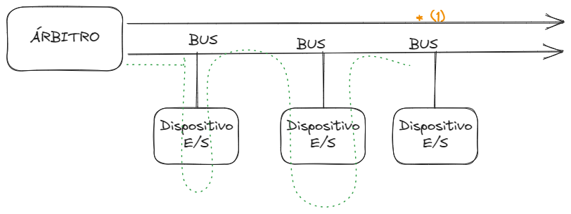
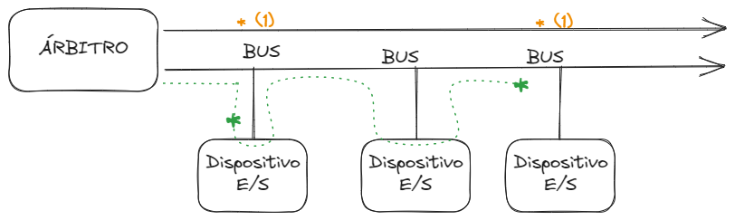

# [[Organizacion y Arquitectura de Computadoras]]
	- ## Tema: El BUS del Sistema
		- ### Caracteristicas
		  logseq.order-list-type:: number
			- La caracteristica clave del BUS es que se trata de un medio de transmision compartido de conductores en el que se conectan varios dispositivos y cualquier señal transmitida por uno de estos dispositivos esta disponible para que los otros dispositivos conectado al BUS de sistemas puedan acceder a ella.
			- Físicamente el BUS  de sistema es un conjunto de conductores eléctricos que son líneas de metales muy finas grabadas en una tarjeta de fibra de vidrio en la placa madre.
		- ### [[Estructura]] del BUS:
		  logseq.order-list-type:: number
			- El BUS esta constituido usualmente por entre 50 y 100 lineas de conductores y a cada linea se le asigna un significado o una funcion particular y estas lineas se pueden clasificar en 3 tipos funcionales que son:
				- Lineas de Datos
				  logseq.order-list-type:: number
				- Lineas de Direcciones.
				  logseq.order-list-type:: number
				- Lineas de Control
				  logseq.order-list-type:: number
			- Explicacion de las Lineas
				- Lineas de Datos.
				  logseq.order-list-type:: number
					- Definicion:
						- Estas proporcionan un camino para transmitir datos entre los modulos del sistema y el conjunto constituido por estas lineas se denomina BUS de Datos.
						- Puesto que cada linea solo puede transportar 1 Bit cada vez, el numero de lineas determina cuantos Bits se pueden transferir al mismo tiempo
						- El BUS  de Datos generalmente consta de 8, 16 o 32 líneas distintas, cuya anchura determina la anchura del BUS
				- Linea de Direccion
				  logseq.order-list-type:: number
					- Definicion:
						- Esta se utilizan para designar la fuente o destino del dato situado en el BUS de datos y estas lineas se denominan BUS de direcciones
						- La anchura del BUS de direcciones determina la maxima capacidad de memoria posible en el sistema
				- Lineas de Control
				  logseq.order-list-type:: number
					- Definicion:
						- Estas se utilizan para controlar el acceso y el uso de las lineas de datos y de direcciones y estas lineas se denominan BUS de Control
		- ### Las especificaciones de BUS 
		  logseq.order-list-type:: number
			- 3.1. Mecanica:
				- Estas son las referidas a cuando contactos tiene y como se fijan fisica y mecanicamente las tarjetas en las renuras de la placa madre.
			- 3.2. Electricas:
				- Estas se refieren a como se realiza la alimentacion electrica de las tarjetas conectadas a las ranuras de la placa.
			- 3.3. De Procedimiento:
				- estas se refieren a como se realizan el procedimiento de las señales que deben intercambiar los dispositivos, el orden de ejecucion y el tiempo que debe permanecer activa la señal en el BUS del sistema
		- ### El funcionamiento del BUS
		  logseq.order-list-type:: number
			- Existen 2 formas o métodos de funcionamiento del BUS que son las siguientes.
				- Metodo con encadenamiento
				  logseq.order-list-type:: number
					- 
					  logseq.order-list-type:: number
				- Método con prioridad
				  logseq.order-list-type:: number
					- 
					  logseq.order-list-type:: number
			- #### Explicacion de los métodos
				- Método con encadenamiento:
				  logseq.order-list-type:: number
					- En este metodo cuando un dispositivo quiere iniciar una transferencia activa la señal de solicitud y el árbitro del BUS detecta la señal del dispositivo que quiere utilizar el BUS y cuando las lineas estan disponibles, el árbitro activa la señal de otorgamiento de la operación a ejecutar y esa señal viaja en cadena de un dispositivo a otro atravezando a todos hasta llegar al dispositivo que realizo la solicitud de ejecucion
				- Método con prioridad:
				  logseq.order-list-type:: number
					- En este método si dos o mas dispositivos solicitan al mismo tiempo el BUS, al dispositivo más cercano al árbitro del BUS se le da la señal de otorgamiento para la ejecución, iniciandose luego la transferencia al otro dispositivo que se encontraba en solicitud también.
					- En este caso el dispositivo que esta mas alejado del arbitro debe esperar que termine la transferencia del dispositivo que solicito primero el BUS del sistema para ejecutar su operación
		- ### Clasificación del BUS 
		  logseq.order-list-type:: number
			- Dependiendo de los ciclos de tiempo, o sea, de su temporización la forma en la que se coordinan los eventos en el BUS, los BUSes pueden clasificarse en 2 categorias que son:
				- BUS Síncrono
				  logseq.order-list-type:: number
				- BUS Asíncrono
				  logseq.order-list-type:: number
			- #### Explicacion de los tipos:
				- BUS Síncrono:
				  logseq.order-list-type:: number
					- En este caso la presencia de un evento esta determinada por el reloj digital del sistema temporizador.
					- El BUS incluye una linea del reloj atravez de la que se transmite una secuencia en la que se alternan valores regulares de igual duracion a 1 (uno) y a cero binario
					- Todos los dispositivos de BUS pueden leer la linea del reloj y todos los eventos empiezan al principio del ciclo del reloj y la mayoria de los eventos se prolongan durante un unico ciclo de tiempo del reloj.
				- BUS Asíncrono:
				  logseq.order-list-type:: number
					- En este caso la presencia de un evento en el BUS es consecuencia y depende de que se produzca un evento previo.
					- Este caso no tiene reloj maestro y la longitud de los ciclos del BUS pueden ser cualquiera que se necesite y no se requiere de que sea la misma entre cada par de dispositivo
		- ### Caracteristicas de las transferencias del BUS 
		  logseq.order-list-type:: number
			- Algunos dispositivos conectados al BUS se encuentran en estado activo y pueden iniciar transferencias, mientras que otros estan en estado pasivo aguardando las solicitudes de ejecucion
			- Los dispositivos activos se llaman "maestro" y los dispositivos pasivos se llaman "esclavos"
			- A menudo las señales binarias que emiten los dispositivos no son lo suficiente fuertes para activar el BUS, en especial si este BUS es relativamente largo o tiene muchos dispositivos conectados.
			- Por eso para activar las señales la mayoria de los dispositivos maestros se conectan al BUS a traves de un chip denominado manejador del BUS que es en esencia un amplificador de señal digital.
		- ### Tipos de transferencias de datos de BUS 
		  logseq.order-list-type:: number
			- Un BUS permite 2 tipos de transferencia de datos que son las siguientes:
				- 7.1. Transferencia de Escritura
				- 7.2. Transferencia de Lectura
			- #### Explicacion:
				- 7.1. Transferencia de Escritura:
					- En esta transferencia el dispositivo maestro pone el dato en el BUS de Datos tan pronto como se haya estabilizado las lineas de direccion y el dispositivo esclavo ha podido reconocer su direccion.
				- 7.2. Transferencia de Lectura:
					- En este caso el dispositivo esclavo pone el dato en el BUS  de Datos tan pronto como se haya reconocido su direccion y disponga del mismo tiempo.
	-
	- ## Explicaciones
		- Los ingenieros les ponen nombres  a sus componentes
		- Le llaman BUS al conjunto de cables o conjunto de conexiones
		- El BUS del sistema es porque son como unas calles y la placa madre es como una ciudad por los que los conductores se desplazan por esas calles
		- No todos los cables hacen lo mismo, hay varios tipo de BUS
		- algunos es solo para datos, hay otros para los que envian instrucciones
		- hay 2 tipos , los dispositivos activos (maestro) y los pasivos que son los (esclavos)
		- ej. el chip multiplexor es activo, porque selecciona y envia el dato
		- ej. el demultiplexor es uno pasivo, porque solo busca el camino
		- el micro es el amo y la memoria es la esclava
		- hay cables de direcciones, datos y lineas de control
		- el bus tiene que tener 3 caracteristicas fundamentales (muy importante)
			- mecanica: es como se arman los componentes (es la idea de como concebir todo y como va a estar hecho)
			- electrica: es como se determina como se va a manejar la electricidad y se maneja con 5 volts como maximo (curiosidad el cuerpo humano trabaja con 6 volts)
			- procedimiento: la computadora teine un reloj digital que determina el tiempo en que va a ejecutarse todo, el tiempo de transferencia entre un dispositivo a otro, la velocidad de impulso determina la velocidad de la maquina
		- tipos de envio del controlador de BUS
			- por encadenamiento: es cuando la señal pasa por varios componentes hasta llegar al componente que se desea activar
			- por prioridad: es cuando el controlador le da la prioridad a uno u otro dispositivo para que se ejecute primero que el otro