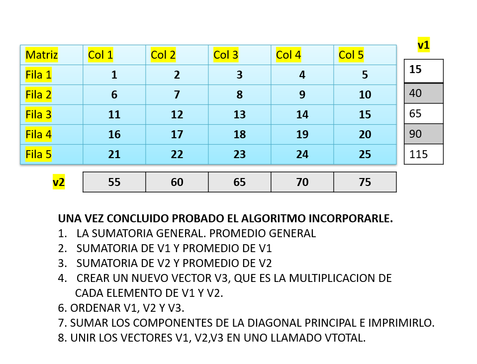

# [[Metodologia de la programacion]]
	- Ejercicios Para el Parcial
		- Comercial CoWorker ha contratado un programador para realizar su sistema de ticket de caja, las ventas se registran en una Matriz de 5 filas y 5 columnas. Como se muestra en la grafica. La Matriz ya tiene cargada el Codigo del Producto, Cantidad, Precio. Su programa debe Calcular el Importe (precio * cantidad) y el acumulado, que es el acumulado de los importes por cada fila de producto que se calcula su importe. Es decir al iniciar Importe y acumulado tienen valores cero.
			- ```c++
			  #include<iostream>
			  
			  using namespace std;
			  
			  //Declaracion de Variables
			  int filas = 5;
			  int columnas = 5;
			  
			  int main(){
			      cout << "Cod\tCant\t Precio\t Importe\t Acumul" << endl;
			      cout << "-------------------------------------------------------" << endl;
			      int matriz[filas][columnas] = {{1,2,10,0,0},{2,3,5,0,0},{3,1,8,0,0},{4,4,12,0,0},{5,2,6,0,0}};
			      int totalGeneral = 0;
			      int acumulado = 0;
			  
			      //Realizar los calculos y llenar las columnas de importe acumulado
			      for(int i = 0;i<filas;i++){
			          matriz[i][3] = matriz[i][1] * matriz[i][2]; //importe = cant * precio
			          acumulado = acumulado + matriz[i][3]; //acumulado = acumulado + importe
			          matriz[i][4] = acumulado;
			          totalGeneral = totalGeneral + matriz[i][3]; //total general = total general + importe
			          //imprimir el detalle de movimientos de productos
			          cout << matriz[i][0] << "\t" << matriz[i][1] << "\t " << matriz[i][2] << "\t  " << matriz[i][3] << "\t         " << matriz[i][4] << endl;
			      }
			      cout << "-------------------------------------------------------" << endl;
			      cout << "Total General: " << totalGeneral << endl;
			      
			  
			      return 0;
			      }
			  ```
		- En un consultorio medico, la Secretaria anota en una planilla excel, los datos del grafico, una macro en excel convierte dichos datos en una matriz, con las siguientes columnas: codigo del medico, hora entrada, hora salida, hora solicitada por el paciente. El programa se encarga de verificar e imprimir si el medico se encuentra en ese rango de horas que solicita el paciente, imprimiendo Agendado o No Agendado.  El programa debe presentar el informe a la Secretaria para que informe a los pacientes si está agendado o no.
			- ```c++
			  #include<iostream>
			  
			  using namespace std;
			  
			  //Declaracion de Variables
			  int filas = 5;
			  int columnas = 5;
			  
			  int main(){
			      cout << "Código\tEntrada\tSalida\tCita\tResultado" << endl;
			      cout << "-------------------------------------------------------" << endl;
			      int matriz[filas][columnas] = {{1,8,12,10,0},{2,9,13,14,0},{3,10,14,12,0},{4,11,15,16,0},{5,12,16,15,0}};
			  
			      //Realizar los calculos y llenar las columnas de importe acumulado
			      for(int i = 0;i<filas;i++){
			          if (matriz[i][3]<matriz[i][2] && matriz[i][3]>matriz[i][1])
			          {
			              matriz[i][4] = 1;
			          }
			          else
			          {
			              matriz[i][4] = 0;
			          }
			          // Imprimir matriz resultado
			          if (matriz[i][4]==1) {
			          cout << matriz[i][0] << "\t" << matriz[i][1] << "\t " << matriz[i][2] << "\t  " << matriz[i][3] << "\t         " << "Agendado" << endl;
			          }else{
			          cout << matriz[i][0] << "\t" << matriz[i][1] << "\t " << matriz[i][2] << "\t  " << matriz[i][3] << "\t         " << "No Agendado" << endl;
			          }
			      }
			      cout << "-------------------------------------------------------" << endl;
			      
			      return 0;
			      }//version mia
			  ```
			- ```c++
			  #include <iostream>
			  const int FILAS = 5;
			  const int COLUMNAS = 4;
			  using namespace std; // pasar matriz a una funcion es por REFERENCIA, el otro caso es por valor.
			  void verificarCita(int matriz[][COLUMNAS]) {
			      cout << "  Cod\tEntrada\tSalida\tCita\tAgendam" << endl;
			      for (int i = 0; i < FILAS; i++) 
			  {
			          cout << matriz[i][0] << "\t" <<matriz[i][1]<< "\t" << matriz[i][2]<< "\t" << matriz[i][3]<< "\t";
			          if (matriz[i][3] >= matriz[i][1] & matriz[i][3] <= matriz[i][2]) 
			          {cout << "Agendado" << endl;}   else {cout << "No Agendado" << endl;}
			      }
			  
			  }
			  
			  int main() {
			    // Cear y Cargar la Matriz de Agendamiento de Citas Medicas
			    int matriz[FILAS][COLUMNAS] = {{1, 8, 12, 10},{2, 9, 13, 14},{3, 10, 14, 12},{4, 11, 15, 16},{5, 12, 16, 15}};
			    // Verificar disponibilidad de medico para atender a pacientes    
			    verificarCita(matriz);
			  
			      return 0;
			  }//version profesor
			  ```
		- El observatorio de Fauna tiene un programa que registra el promedio de temperaturas de los meses del año, su programa debe construir una matriz donde esten los meses del año, junto con las temperaturas del mes y un acumulado de las temperaturas promedio. Mostrar el resultado de como queda la matriz.
			- ```c++
			  #include<iostream>
			  
			  using namespace std;
			  
			  //Declaracion de Variables
			  float vectortemp[12] = {20.5,21.3,22.1,23.8,25.0,27.4,29.2,30.1,28.6,25.9,23.7,21.4};
			  int filas = 12;
			  int columnas = 3;
			  float totalTemperatura = 0;
			  
			  int main(){
			      cout << "Mes\tPromedio\tAcumulado" << endl;
			      cout << "-------------------------------------------------------" << endl;
			      float matriz[filas][columnas] = {{1,0,0},{2,0,0},{3,0,0},{4,0,0},{5,0,0},{6,0,0},{7,0,0},{8,0,0},{9,0,0},{10,0,0},{11,0,0},{12,0,0}};
			  
			      //Realizar los calculos y llenar las columnas de importe acumulado
			      for(int i = 0;i<filas;i++){
			          matriz[i][1] = vectortemp[i];
			          totalTemperatura = totalTemperatura + matriz[i][1];
			          matriz[i][2] = totalTemperatura;
			  
			          //Imprimir las temperaturas y acumulado
			          cout << matriz[i][0] << "\t" << matriz[i][1] << "\t " << matriz[i][2] << endl;
			      }
			      cout << "-------------------------------------------------------" << endl;
			      cout << "Total de Temperatura: " << totalTemperatura << endl;
			      
			      return 0;
			      }//version mia
			  
			  ```
			- ```c++
			  #include <iostream>
			  
			  const int MESES = 12;
			  
			  int main() {
			      double temperatura[MESES] = {20.5, 21.3, 22.1, 23.8, 25.0, 27.4, 29.2, 30.1, 28.6, 25.9, 23.7, 21.4};
			      double acumulacion[MESES][3] ={0};
			  
			      double totalTemperatura = 0.0;
			  
			      std::cout << "---------------------------------------------" << std::endl;
			      std::cout << "  Mes  Promedio Acumulado" << std::endl;
			      std::cout << "---------------------------------------------" << std::endl;
			      for (int i = 0; i < MESES; i++) {
			              acumulacion[i][0] = i + 1; // meses 
			              acumulacion[i][1] = temperatura[i]; //temperatura
			              totalTemperatura += temperatura[i];   //acumulacion
			              acumulacion[i][2] = totalTemperatura; //acumulacion
			  
			  
			          std::cout << "  " << acumulacion[i][0] << "\t" << acumulacion[i][1] << "\t" << acumulacion[i][2] << std::endl;
			      }
			  
			      std::cout << "---------------------------------------------" << std::endl;
			      std::cout << "Total de temperatura: " << totalTemperatura << std::endl;
			  
			      return 0;
			  }//version profesor
			  ```
		- Se tiene las notas finales de 100 alumnos del primera año de la universidad cargadas en un vector llamado notas, que esta 
		   ordenado por numero secuencial empezando por 1 hasta 100, la Administacion ha decidido dividir en 4 grupos distintos de
		  25 alumnos creando una matriz de 4 filas, cada fila tiene el nro de grupo que es secuencial desde 1 y el acumulado de las notas de cada grupo. 
		  A.RECORRER LA MATRIZ 1 POSICION Y LOS BLOQUE DE 25 DEL VECTOR, HASTA LLEGAR 100 VECTOR.
		  B.[[Trabajo]] EN CLASE RECORRER EN FORMA INVERSA, POR VECTOR DE 1 HASTA 100.
			- ```c++
			  #include <iostream>
			  using namespace std;
			  int NUM_ALUMNOS = 100; 
			  int NUM_GRUPOS = 4; 
			  int acumulador; 
			  int contador =0;
			  int main() {
			      // Imprimir CABECERA de la matriz Grupos
			      cout << "Grupo Acumulado" << endl;
			      cout << "---------------" << endl;
			  
			      int notas[100] = {2,3,5,6,7,8,11,22,11,1,2,3,5,6,7,8,11,22,11,33,33,32,66,77,88,99,22,44,31,33,44,11,11,22,44,55,66,66,77,99, 11,22 ,33,33,44,44,78, 85, 92, 67, 75, 88, 93, 80, 97, 85, 70, 81, 89, 92, 95, 88, 76, 83, 90, 84, 77, 94, 91, 86, 79, 96, 82, 87, 73, 98, 99, 72, 100, 68, 71, 74, 69, 66, 63, 60, 62, 64, 65, 61, 59, 58, 57, 55, 54, 56, 53, 51, 52, 100};
			      int grupos[NUM_GRUPOS][2] = {{1, 0}, {2, 0}, {3, 0}, {4, 0}}; // Matriz Grupos
			      for (int i = 0; i < NUM_GRUPOS; i++){
			          acumulador = 0; // Acumulado de notas del grupo
			          for (int j = 0 ; j < 25; j++){ // Acumular la nota del alumno en el grupo
			              acumulador = acumulador + notas[contador]; //el contador es el que no se reinicia en el bucle, es decir llega hasta 25, luego desde 26 a 50, y asi sucesivamente
			              contador++;
			          } 
			          grupos[i][1] = acumulador; 
			          // Imprimir DETALLE de la matriz Grupos
			          cout << grupos[i][0] << "     " << grupos[i][1] << endl;       
			      }
			      return 0;
			  }//version profesor
			  ```
		- Realizar un Programa en C más más que precargue una matriz de 5x5. y que cree 2 vectores, v1 y v2, cada componente de v1 tendrá la suma de los elementos de cada fila de la matriz, y v2 será cada elemento la suma de todos los componentes de las columnas de cada matriz. Realizar el código y luego mostrar en tablas como será el resultado de las mismas.
			- 
			- ```c++
			  #include <iostream>
			  using namespace std;
			  
			  const int N = 5; // Definimos el tamaño de la matriz 5x5
			  
			  // Función para mostrar una matriz
			  void mostrarMatriz(int mat[N][N]) {
			      for (int i = 0; i < N; i++) {
			          for (int j = 0; j < N; j++) {
			              cout << mat[i][j] << "\t";
			          }
			          cout << endl;
			      }
			      cout << endl;
			  }
			  
			  // Función para mostrar un vector
			  void mostrarVector(int vec[], int size, string nombre) {
			      cout << nombre << ": \t";
			      for (int i = 0; i < size; i++) {
			          cout << vec[i] << "\t";
			      }
			      cout << endl;
			  }
			  
			  int main() {
			      // Precargamos una matriz 5x5 con valores de ejemplo
			      int matriz[N][N] = {
			          {1, 2, 3, 4, 5},
			          {6, 7, 8, 9, 10},
			          {11, 12, 13, 14, 15},
			          {16, 17, 18, 19, 20},
			          {21, 22, 23, 24, 25}
			      };
			  
			      // Definimos los vectores v1 y v2
			      int v1[N] = {0};  // v1 tendrá la suma de las filas
			      int v2[N] = {0};  // v2 tendrá la suma de las columnas
			  
			      // Calcular la suma de filas (v1) y la suma de columnas (v2)
			      for (int i = 0; i < N; i++) {
			          for (int j = 0; j < N; j++) {
			              v1[i] += matriz[i][j];  // Suma de la fila i
			              v2[j] += matriz[i][j];  // Suma de la columna j
			          }
			      }
			  
			      // Mostramos la matriz original
			      cout << "Matriz original (5x5):" << endl;
			      mostrarMatriz(matriz);
			  
			      // Mostramos el vector v1 (suma de filas)
			      mostrarVector(v1, N, "Vector v1 (Suma de filas)");
			  
			      // Mostramos el vector v2 (suma de columnas)
			      mostrarVector(v2, N, "Vector v2 (Suma de columnas)");
			  
			      return 0;
			  }
			  ```
		-