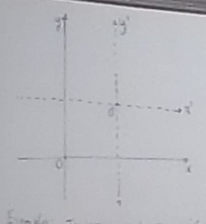
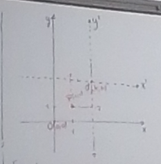
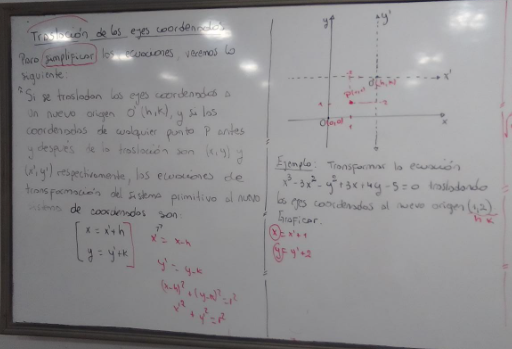
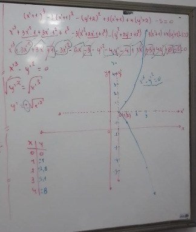
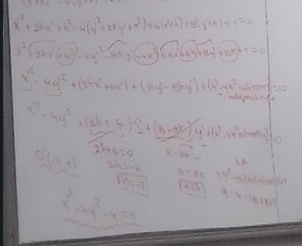
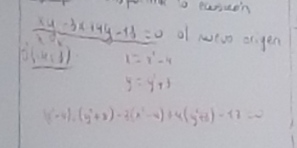
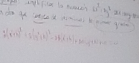

# [[Vectores y Geometria Analitica]]
	- ## Traslacion de los ejes coordenadas
		- para simplificar las ecuaciones, veremos lo siguiente:
			- "Si se trasladan los ejes coordenadas a un nuevo origen $$O'\ (h,k)$$, y si las coordenadas de cualquier punto $$P$$ antes y despues de la traslacion son $$(x,y)$$ y $$(x',y')$$ respectivamente, las ecuaciones de transforamcion del sistema primitivo al nuevo sistema de coordenadas son:
			- $$x = x' + h$$
			- $$y = y' + k $$
				- Adicionales
					- x' = x-h
					- y' = y-k
					- $$(x-h)^2 + (y-k)^2 = r^2$$
			- 
			- 
			- 
			- Ejemplo: Transformar la ecuacion $$x^3-3x^2-y^2+3x+4y-5=0$$ trasladadando los ejes coordenadas al nuevo origen $$(1,2)$$
			- Graficar
				- //se reemplaza la ecuacion original (1,2) es (h,k)
				- x = (x' + 1)
				- y = (y' + 2)
				- //se reemplaza la formula
				- $$x^3-3x^2-y^2+3x+4y-5=0$$
				- $$(x' + 1)^3-3(x' + 1)^2-(y' + 2)^2+3(x' + 1)+4(y' + 2)-5=0$$
				- se resuelve con cubo de un binomio y binomio al cuadrado
				- $$x'^3 - y'^2 = 0$$
				- $$\sqrt{y'^2} = \sqrt{x'^3} $$
				- $$y' = +- \sqrt{x'3}$$
				- 
		- ### Consideraciones
			- por ejemplo si es que el punto estaba en el primer cuadrante, en la traslacion pasa a estar en el 3er cuadrante, entonces hay que buscar su equivalente en el tercer cuadrante
		- ## Ejemplo
			- por una traslacion de los ejes, simplificar la ecuacion $$x^2 - 4y^2 + 6x + 8y + 1 = 0$$ en otra que carezca de terminos de primer grado
				- x = (x' +h)
				- y = (y' + k)
				- $$x^2 - 4y^2 + 6x + 8y + 1 = 0$$
				- $$(x' +h)^2 - 4(y' + k)^2 + 6(x' +h) + 8(y' + k) + 1 = 0$$
				- //se calcula binomio al cuadrado y se multiplican por los parentesis
				- //los que son x'^1 se igualan a cero
				- 
				-
				-
		- ## Ejemplo
			- trasnformar la ecuacion $$xy - 3x + 4y - 13 = 0 $$ al nuevo origen (-4,3)
			- 
			- x = (x' -4)
			- y = (y' + 3)
			- $$(x' -4)(y' + 3) - 3(x' -4) + 4(y' + 3) - 13 = 0 $$
			- $$x'y' + 3x' -4y' -12 - 3x' + 12 + 4y' + 12 - 13 = 0 $$
			- $$x'y' - 1 = 0 $$
		- ## Ejemplo
			- simplificar la ecuacion $$2x^2 + 5y^2 - 28x + 20y + 10 = 0 $$ en otra que carezca de terminos de primer grado
				- 
				- x = (x' -h)
				- y = (y' + k)
				- $$2x^2 + 5y^2 - 28x + 20y + 10 = 0 $$
				- $$2(x' -h)^2 + 5(y' + k)^2 - 28(x' -h) + 20(y' + k) + 10 = 0 $$
				- $$2(x'^2-2x'h+h^2) + 5(y'^2+2y'k+k^2) - 28x' +28h + 20y' + 20k + 10 = 0 $$
				- $$2x'^2-4x'h+2h^2 + 5y'^2+10y'k+5k^2 - 28x' +28h + 20y' + 20k + 10 = 0 $$
				- $$2x'^2 - 4x'h + 2h^2 + 5y'^2 + 10y'k + 5k^2 - 28x' +28h + 20y' + 20k + 10 = 0 $$