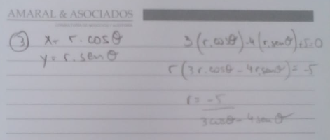

# [[Vectores y Geometria Analitica]]
	- ## Sistema de coordenadas polares
		- En el sistema polar, un punto se localiza especificando su posicion con respecto a una recta fija y un punto fijo de esa recta.
			- "La recta fija se llama eje polar"
			- "El punto fijo se llama polo"
			- r= |OP|
			- 
			- 
			- [[draws/2024-12-19-10-08-13.excalidraw]]
			-
			- (())
		- ### Paso de coordenadas rectangulares a polares y viceversa
			- Si el polo y el eje polar del sistema de coordenada polar, coinciden, respectivamente con el origen y la parte positiva del eje "x" de un sistema de coordenadas rectangulares, el paso de uno a otro puede efectuarse por medio de las siguientes transformaciones:
				- 
				- x = r . cos 0
				- y = r . sen 0
				- x^2 + y^2 = r^2
				- .
				- tg 0 = y/x
				- 0 = tg^-1(y/x)
				- 
				- 
				-
		- #### Ejercicios
			- Hallar las coordenadas rectangulares del punto P cuyas coordenadas polares son P(4, 120grados)
			  logseq.order-list-type:: number
				- 
			- Hallar un par de coordenadas polares del punto P cuyas coordenadas rectangulares son (3,-5)
			  logseq.order-list-type:: number
				- 
			- En un sistema polar trazar P1(1,135grados), P2(-2, pi/3) y P3(3,75grados)
			  logseq.order-list-type:: number
				- Por formula $$r = 3sen \ominus$$
				- 
				- https://www.geogebra.org/geometry/kp23bfze
				- 
				-
		- Explicaciones
			- coseno es el cateto adyacente
			- seno es el cateto opuesto
			- para calcular hay que ver que la calculadora este en sistema Hexadecimal
				- para graficar
					- cuando es positivo se dibuja en la parte de arriba, cuando es negativa se hace a la inversa
	- ## Distancia entre dos puntos
		- La distancia entre dos puntos $$P1(r_1, \ominus_1)$$ y $$P2(r_2, \ominus_2)$$ en coordenadas polares se puede obtener mediante:
			- $$d = \sqrt{r^2_1 + r^2_2 - 2 r_1 r_2 \cos(\ominus_1 - \ominus_2)}$$
		- Ejemplo:
			- Demostrar que los puntos $$P1(3, \frac{\pi}{6})$$ , $$P2(7, \frac{\pi}{3})$$ y $$P3(3, \frac{\pi}{2})$$ son los vertices de un triangulo isosceles
				- 
		- Ejemplo:
			- Hallar la distancia entre los puntos $$P1(2, \frac{\pi}{6})$$ y $$P2(4, \frac{5 \pi}{4})$$
				- 
	- ## Ecuacion de la recta
		- Si la recta pasa por el polo, su ecuacion es de la forma $$\ominus = k$$, siendo "$$k$$" una constante que puede restringirse a valores no negativos menores a $$180 \degree$$.
		  logseq.order-list-type:: number
		- Si la recta es perpendicular al eje polar y esta a "$$p$$" unidades del polo, su ecuacion es ($$r \cdot  \cos{\ominus} = \frac{+}{-} p$$) debiendo tomar el signo positivo o negativo segun que la recta este a la derecha o a la izquierda del polo
		  logseq.order-list-type:: number
		- Si la recta es paralela al eje polar y esta a "$$p$$" de él, su ecuacion es ($$r \cdot \text{sen}{\ominus} = \frac{+}{-} p$$) debiendo tomar positivo o negativo segun que la recta este por arriba o abajo del eje polar.
		  logseq.order-list-type:: number
		- Si $$(p,x)$$ es el par principal del pie de la perpendicular trazada desde el polo a cualquier recta en el plano coordenada polar su ecucaion es:
		  logseq.order-list-type:: number
			- $$l : r \times \cos{(\ominus - \angle)} = p$$
			- 
			- Ejemplo: Transformar la ecuacion $$3x - 4y + 5 = 0$$ a la forma polar
				- 
	- ## Ecuacion de la circunferencia en polares
		- grafico
		- 
		- 
		- Teorema del coseno
			- $$a^2 = b^2 + c^2 - 2bc \ \cos(\theta - \alpha)$$
		-
		- La ecuacion polar de la circunferencia de centro punto $$C(c, \alpha)$$ y radio igual a "$$a$$" es:
			- $$r^2 - 2 \cdot cr \cdot \cos{(\theta - \alpha)} + c^2 = a^2$$
			- Si la circunferencia pasa por el polo y su centro esta sobre el eje a $$90 \degree$$, su ecuacion es de la forma:
			  logseq.order-list-type:: number
				- $$r = \frac{+}{-} 2 a \cdot \text{sen}(\theta)$$
				- debiendose tomar positivo o negativo segun el centro este por encima o por debajo del polo
		- Ejemplo:
			- Hallar el centro y el radio de la circunferencia a partir de la ecuacion polar $$r^2 - 2 \sqrt{2} \  r \  \cos \theta - 2 \sqrt{2} \  r \  \text{sen} \theta - 5 = 0$$
				- a
	- Explicacion
		- $$\alpha $$ es la variacion de $$\theta$$