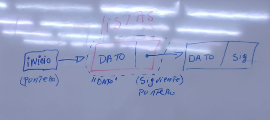
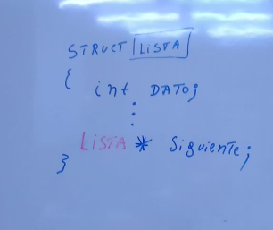
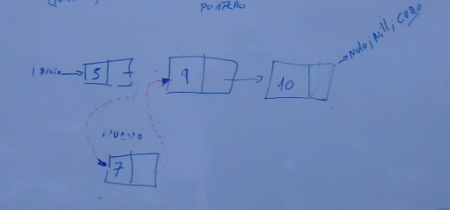
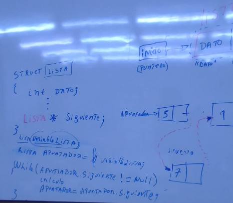
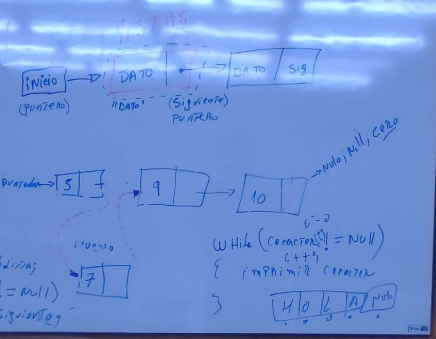

# [[Metodologia de la programacion]]
	- ## [[Estructura]] de datos
		- La diferencia con una matriz es que puede tener distintos tipos de datos
		- En otros lenguajes se les conoce como registros
		- El estándar del lenguaje C es definido por el **ANSI (American National Standards Institute)**
		- Definicion Basica es que 1 caracter = 8bit -> Byte
		- El minimo elemento que puede manejar el lenguaje C es 1 Byte
			- char = 1 Byte (0-255)
			- int = 1 Byte (0-255)
		- Como el dato minimo para trabajar en lenguaje C es el Byte, cuando se habla de expresiones booleanas ya es mucha informacion, por tanto se utiliza UNION
			- ```c++
			  (char) UNION |Registro| {
			  Ra0: 1
			  Ra2: 1
			  ...
			  Ra7: 1
			  }
			  ```
			- [[draws/2024-11-19-19-26-04.excalidraw]]
			- ```c++
			  RA1 = 0;
			  RA1 = 1; //ambos constituyen 1 Bits
			  
			  Registro = 0*((1111101)/Byte);
			  ```
		- Para definir un dato se utiliza "Typedef"
			- sintaxis
				- ```c++
				  typedef <tipo> <nuevo nombre>;
				  //ejemplo
				  typedef int positivo;
				  ```
		- Sintaxis de [[Estructura]] (importante!)
			- ```c++
			  //palabra reservada struct -- nombre unico "mi_estructura"
			  struct mi_estructura{
			    int miembro; //lista de miembros
			    char miembro2;
			    double miembro3;
			    ...
			  
			  }variable; //se puede crear opcionalmente variable del tipo Registro, incluso sin Nombre Unico
			  ```
		- Luego se define la variable
			- ```c++
			  //opcion 1
			    struct mi_estructura mi_estructura1;
			  //opcion 2
			    mi_estructura mi_estructura1;
			  ```
		- Una vez definida la variable, para acceder a los valores del miembro se utiliza el punto para acceder a un elemento de la [[Estructura]]
			- ```c++
			  mi_estructura1.miembro1 = 1024 //asignar
			  mi_estructura1.miembro2 = x //asignar
			    mi_estructura1.miembro3 = 1024124 //asignar
			  ```
		- Un lenguaje orientado a objetos no es mas que un un lenguaje que utiliza apuntadores "->"
	- ## Ejemplos
		- ```c++
		  #include<iostream>
		  #include<string>
		  
		  using namespace std;
		  
		  struct cliente{
		    int cedula;
		    string nombre;
		    int saldo;
		  };
		  
		  int main(){
		    cliente alejandro;
		    cliente alejandra;
		    
		    alejandro.cedula = 123;
		    alejandro.nombre = "Alejandro Espinola";
		    alejandro.saldo = 5000;
		    
		    alejandra.cedula = 456;
		    alejandra.nombre = "Alejandra Ramirez";
		    alejandra.saldo = 2000;
		    
		    cout << "Cedula: " << alejandro.cedula << endl;
		    cout << "Nombre: " << alejandro.nombre << endl;
		    cout << "Saldo: " << alejandro.saldo << endl;
		    cout << endl;
		    cout << "Cedula: " << alejandra.cedula << endl;
		    cout << "Nombre: " << alejandra.nombre << endl;
		    cout << "Saldo: " << alejandra.saldo << endl;
		    return 0;
		  }//version 1
		  ```
		- ```c++
		  #include<iostream>
		  #include<string>
		  
		  using namespace std;
		  
		  struct cliente{
		    int cedula;
		    string nombre;
		    int saldo;
		  };
		  cliente vclientes[2] = {{123,"Alejandro Espinola",5000},{456,"Alejandra Ramirez",2000}};
		  
		  int main(){
		    
		    cout << "Cedula: " << vclientes[0].cedula << " ";
		    cout << "Nombre: " << vclientes[0].nombre << endl;
		    cout << "Saldo: " << vclientes[0].saldo << endl;
		    cout << endl;
		    cout << "Cedula: " << vclientes[1].cedula << endl;
		    cout << "Nombre: " << vclientes[1].nombre << endl;
		    cout << "Saldo: " << vclientes[1].saldo << endl;
		    
		    return 0;
		  }//version 2
		  ```
		- ```c++
		  #include<iostream>
		  #include<string>
		  
		  using namespace std;
		  
		  struct cliente{
		    int cedula;
		    string nombre;
		    int saldo;
		  };
		  cliente vclientes[2] = {{123,"Alejandro Espinola",5000},{456,"Alejandra Ramirez",2000}};
		  
		  int main(){
		    cout << "Cedula \t" << "" << "Nombre \t\t\t" << "" << "Saldo \t" << endl;
		  
		    cout << vclientes[0].cedula << " \t" << vclientes[0].nombre << " \t" << vclientes[0].saldo << endl;
		    cout << vclientes[1].cedula << " \t" << vclientes[1].nombre << " \t" << vclientes[1].saldo << endl;
		    
		    return 0;
		  }//version 3
		  ```
	- [[Estructura]] de Listas Encadenadas
		- |INICIO|->|Dato|-|->|Dato|Siguiente|
		- |(Puntero))|->|"Dato1"|Siguiente|->|Dato|Siguiente|
		- 
		- 
		- 
		- 
		- 