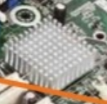
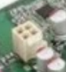

# [[Taller de Computadoras]]
	- La materia se trata de armar la computadora y sus componentes
	- Profesor: Rafael Ehrecke (éreque)
	- GuillermoRafaelEhrecke67@gmail.com
	- Se utilizara Aula Virtual de Apoyo
	-
	- Identificar los componentes del computador
		- Arquitectura Von Newmann
		- [[draws/2025-02-12-18-59-23.excalidraw]]
		- Esto es el nucleo o lo principal del computador
		- Dispositivo de Entrada
			- Camara
			- Escaner
			- Teclado
		- Dispositivo de Salida
			- Monitor
			- Altavoz
			- Impresora
		-
		- La Eniac se programaba con cables
		- 
		- El Chipset
		- 
		- Conexion adicional para procesadores de alta necesidad energica
		- 
		-
	-