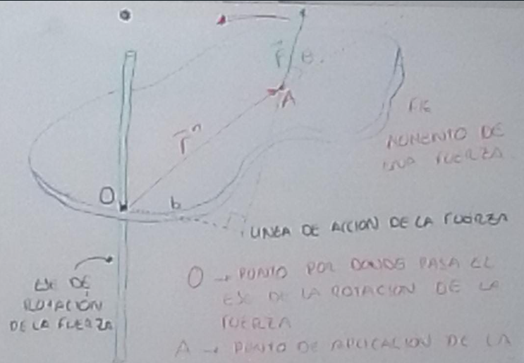
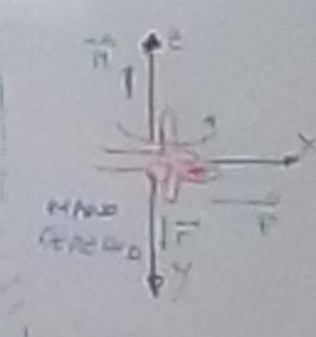
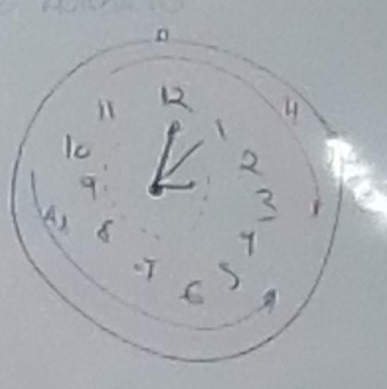

# [[Fisica 1 (Mecanica)]]
	- ## Clase
		- ## Leyes de Newton
			- Fueron enunciadas en el siglo XVIII por Isaax Newton (1693-1727),Fisico y Matematico Ingles fundador de los estudios sobre gravitación mecanica y calculo.
			- ### I) La primera Ley o Ley de Inercia
				- Establece que si sobre un punto material la fuerza resultante es nula, el mismo estará en reposo o con movimiento rectilineo uniforme **(MRU)**. es decir:
				- $$\sum \vec{F} = 0 \ \text{ó} \ \vec{F}r = 0 \rightarrow \vec{a} = c \left\{ \begin{matrix} \text{Reposo} \\ \text{MRU} \end{matrix} \right\}$$
			- ### Estatica (Torque o momento de una fuerza equilibrio de los cuerpos)
				- Uno de los efectod de la fuerza es la rotacion, se define el momento de una fuerza o momento de torsion como la tendencia a producir un cambio en el movimiento de rotacion. matematicamente se expresa como:
				- $$M = r \cdot F \cdot \sin \theta$$
				- #### Grafico
					- {:height 267, :width 364}
					- O -> punto por donde pasa el eje de la rotacion de la fuerza
					  A -> punto de la aplicacion de la fuerza
					  .$$\vec{r}$$ -> vector de posicion
					  b -> brazo de palanca de la fuerza
					- El Ecuacion $$M = (F \cdot \sin \theta ) \cdot r = F y \cdot r = F ( r \cdot \sin \theta ) = F \cdot b$$ , donde la ultima expresion $$M = F \cdot b $$ es utilizada frecuentemente para el calculo de momento
					- El Momento de una fuerza es un vector, por lo que debe definirse tambien la direccion y sentido. El momento $$\vec{M}$$ es perpendicular a la fuerza $$\vec{F}$$ y al vector de posicion $$\vec{r}$$ , es decir, es perpendicular al plano formado por $$\vec{r} \text{ y } \vec{F}$$
					- El sentido de $$\vec{M}$$ se determina por la regla de la mano derecha o la regla del sacacorchos.
					- Convencionalmente es (+) positivo si la rotacion corresponde al sentido antihorario y (-) negativo en sentido horario
					- {:height 206, :width 165}
					- {:height 189, :width 170}
			- ### Observaciones
				- A -  Si varias fuerza, no concurrentes, actuan sobre un cuerpo cada una de ellas producira un TORQUE, luego la suma vectorial de ellas dara el TORQUE resultante.
				- B -  La linea de accion de una fuerza es una linea imaginaria extendida infinitamente a lo largo del vector en toda la direccion.
				- C -  El brazo de palanca de una fuerza es la distancia perpendicular trazada desde la linea de accion de la fuerza al eje de rotacion.
				- D - El centro de gravedad o centro de masa (consideremos equivalencias) es un punto en el cual se puede considerar que todo el peso del cuerpo se concentra. El centro de gravedad de un cuerpo regular se localiza en su centro geometrico.
			- ## Condiciones de Equilibro
				- [[draws/2025-02-18-19-51-42.excalidraw]]
				-
				- Particula
					- $$\sum \vec{F} = 0 \text{ ó } \vec{a} = 0$$
					  La particula puede estar en reposo o con (MRU)
				- Cuerpo Extenso
					- $$\sum \vec{F} = 0 \text{ ó } \vec{a}_{\text{CM}} = 0$$ Equilibrio de traslacion
					  $$\sum \vec{M} = 0 $$ Equilibrio de rotacion
			-
				-
	- ## Explicaciones
		- [[draws/2025-02-18-18-34-09.excalidraw]]
		- Inercia, que significa
			- Oponerse al cambio
			- depende del observador el estado del objeto
		- Sacacorchos
		- Mano Derecha
		- En esta clase se habla de palanca $$M = F \cdot b$$
		-
		-
	-