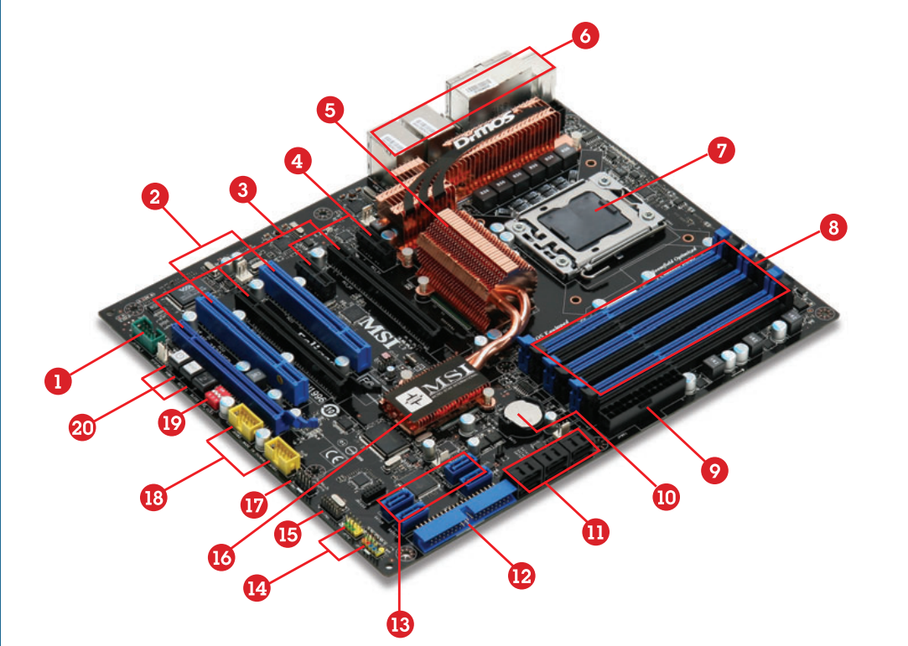
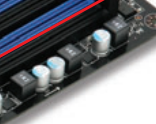

# [[Taller de Computadoras]]
	- Arquitectura Von Newman
		- ((67ad19ab-db26-490a-b9db-1fcc3df17e61))
		- UC = Unidad de Control
		- UAL = Unidad Aritmético Lógico
	- Tipos de Buses
		- Bus de Direccion
		- Bus de Datos
		- Bus Control
	- Los circuitos impresos son los Buses
	- Se identifican las partes de la placa madre
		- CPU
		- Memoria Ram
		- Dispositivos de Entrada y Salida
		- PCI y PCI Express
		- 
		- Chipset es un [[Soporte]] auxiliar del procesador, para liberar de una carga adicional
		- La diferencia entre puente norte y puente sur es que
			- norte, controla los dispositivos de alta velocidad (ej. la memoria ram, la gpu)
				- trabaja a velocidad de procesador
				- en dispositivos actuales, algunas placas no tienen puente norte porque estan integradas en la cpu
			- sur, controla los dispositivos de baja velocidad (ej. almacenamiento secundario (sata) )
		- La pila o bateria es para mantener la informacion de la BIOS
		- Pines conectores de panel frontal
		- Estabilizadores de corriente
			- 
		- El socalo depende del fabricante (AMD, Intel)
			- El chipset tambien depende del fabricante
		- Depende del procesador para que la memoria ram sea ddr3, ddr4, ddr5
		- Depende de los componentes para tener una fuente de energia mas o menos potente
		- Hay que tener en cuenta el tamaño del gabinete y el tamaño de la placa para ensamblar una computadora
		- # Resumen Fundamentos de hardware en base a preguntas
			- un sistema informatico de que esta computo
				- componentes de un ordenador
					- fisicos
						- procesador
							- uc (unidad de control)
							- ual (unidad aritmetico-logica)
						- memoria principal
						- bus del sistema
						- perifericos
					- logicos
						- software base: es el sistema operativo (windows,linux, unix)
						- software de apliacaion: los programas que se ejecutan como puede ser el word, un edito de fotos, juegos, etc.
			- Esquema de la arquitectura de Von Neumann de un ordenador
		- Pasos para montar una computadora
			- Identificar la necesidad
	-