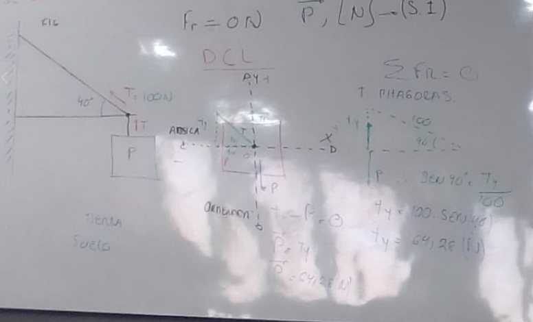
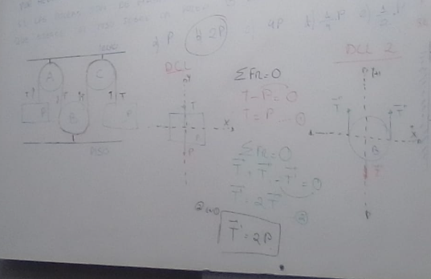
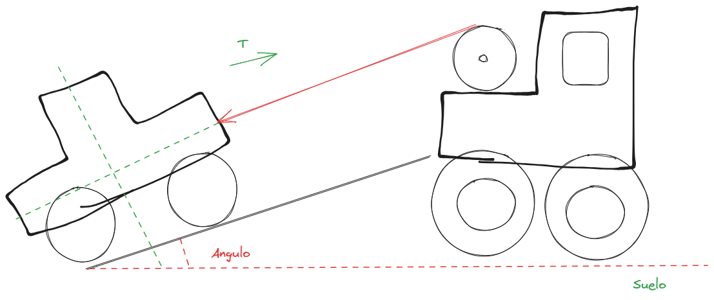
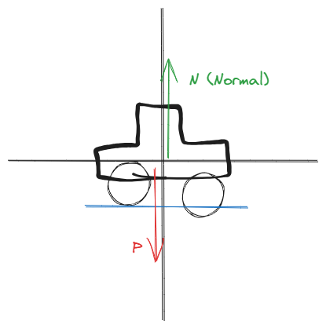
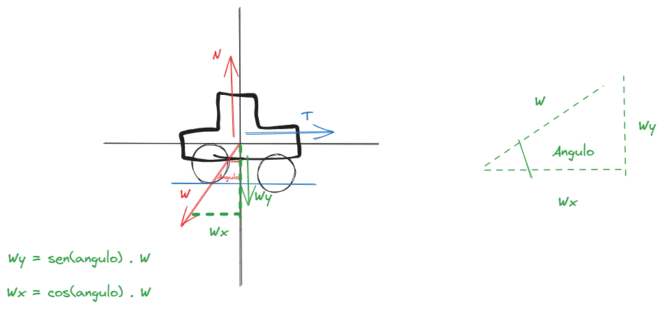
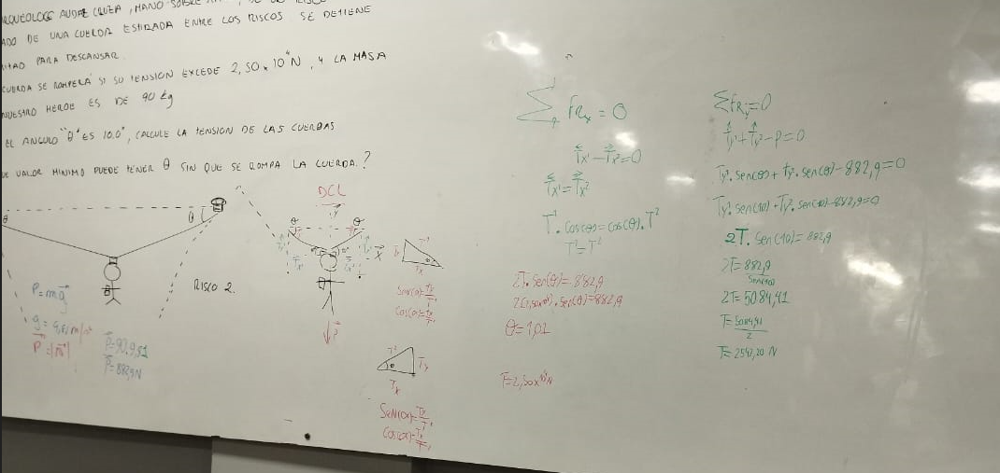

# [[Fisica 1 (Mecanica)]]
	- Laboratorios Fisica Mecanica (Ciencias) - Llevar Bata
		- 11/03/2025 - Martes - 18:30 - 20:00 hs
		  logseq.order-list-type:: number
		- 22/04/2025 - Martes - 18:30 - 20:00 hs
		  logseq.order-list-type:: number
		- 03/06/2025 - Martes - 18:30 - 20:00 hs
		  logseq.order-list-type:: number
		- Recuperacion Sabado 14/06/2025 - 13:00 - 14:30 hs.
		  logseq.order-list-type:: number
	- Fecha de Entrega de los Informes ( Resumen de los laboratorios en Aula Virtual)
		- Viernes - 21/03/2025 - 23:59 hs. - Plataforma virtual
		  logseq.order-list-type:: number
		- Viernes - 02/05/2025 - 23:59 hs. - Plataforma virtual
		  logseq.order-list-type:: number
		- Viernes - 13/06/2025 - 23:59 hs. - Plataforma virtual
		  logseq.order-list-type:: number
	- # Clase
		- ## Ejercicios de Aplicacion
			- La tension maxima capaz de soportar el cable de la figura es de 100N, Cual es el peso maximo P que puede soportar el sistema de la figura si se deprecia el rozamiento en la pared vertical?
			  logseq.order-list-type:: number
				- [[draws/2025-02-25-18-46-57.excalidraw]]
				- $$\vec{P}, N \rightarrow (S.I.)$$ (Sistema Internacional)
				- $$Fr = 0 N$$
				- Diagrama Cuerpo Libre DCL
					- [[draws/2025-02-25-18-54-41.excalidraw]]
					- $$\sin (40 \degree) = \frac{Ty}{100}$$
					- $$\sin 40 \degree = 100 \cdot (40 \degree)$$
					- $$Ty = 64,28 N$$
					- {:height 478, :width 776}
			- La figura representa 2 cuerpos del mismo peso unidos por medio de Hilos Ligeros e Inextendibles si las poleas son de masa despreciable, la fuerza que ejerce el piso sobre la polea B Vale:
			  logseq.order-list-type:: number
			  collapsed:: true
				- a) $$P$$ b) $$2P$$ c) $$4 \cdot P$$ d) $$\frac{1}{4} \cdot P$$ e)$$\frac{1}{2} \cdot P$$
				- [[draws/2025-02-25-19-20-13.excalidraw]]
				- a) Paso 1 DCL (Diagrama del cuerpo libre)
					- [[draws/2025-02-25-19-25-47.excalidraw]]
				- b) DCL
					- [[draws/2025-02-25-19-29-16.excalidraw]]
					- 
					-
				-
				-
			- Un automovil de peso W descansa sobre los rieles inclinados de una rampa que conduce a un remolque solo un cable conectado al auto y a la armazon del remolque evita que el auto baje la rampa, (los frenos y la transmision del auto estan desactivados). Calcule la tension del cable y la fuerza con que los rieles empujan los neumaticos.
			  logseq.order-list-type:: number
				- [[draws/2025-02-25-19-42-08.excalidraw]]
				- 
				- DCL (Plano Inclinado) Tener en cuenta el auto
				- [[draws/2025-02-25-19-49-21.excalidraw]]
				- 
				- [[draws/2025-02-25-19-55-30.excalidraw]]
				- 
				- $$\sum Fr = 0$$
				- $$\vec{n} - Wy = 0$$
				- $$\vec{n} = \sin{\alpha} \cdot W$$
				- $$T - Wx = 0$$
				- $$T = \cos{\alpha} \cdot W$$ //Tension del Cable - Resultado
				- [[draws/2025-02-25-20-35-35.excalidraw]]
			- Un arqueologo audaz cruza, mano sobre mano, de un risco a otro colgado de una cuerda estirada entre los riscos. Se detiene la mitad para descansar.
			  logseq.order-list-type:: number
			  La cuerda se rompera si su tension excede $$2,50 \times 10^4N , 4$$ la masa de nuestro heroe es de 90kg
			  a) si el angulo $$\theta$$ es de $$10,0 \degree$$, calcule la tension de las cuerdas
			  b) Que valor minimo puede tener $$\theta$$ sin que se rompa la cuerda?
				- [[draws/2025-02-25-20-41-06.excalidraw]]
				- DCL (Diagrama del Cuerpo Libre)
					- [[draws/2025-02-25-20-46-44.excalidraw]]
					- b)
						- [[draws/2025-02-25-21-08-26.excalidraw]]
						- 
						-
				-
				-
				-
			- logseq.order-list-type:: number
	- # Explicaciones
		- Se estudia a la persona, no al vehiculo
		- Horizonte = Absisa = x
		- Ordenada = y
		- [[Soporte]] = es aguante
		- La suma de todas las fuerzas es igual a 0 $$\sum FR = 0$$
		- P = Tierra = Suelo (Siempre depende del observado)
		- Teorema de pitagoras $$\sin 40 \degree = 100 \cdot (40 \degree)$$
		- Se responde con 2 decimales