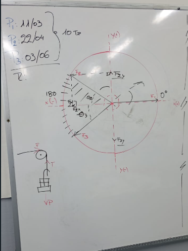
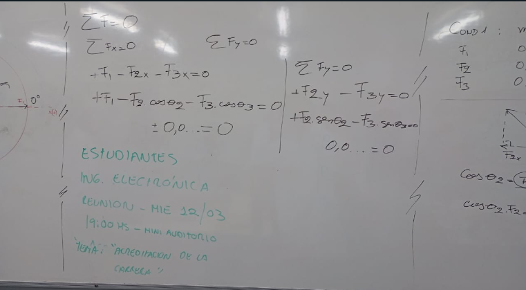
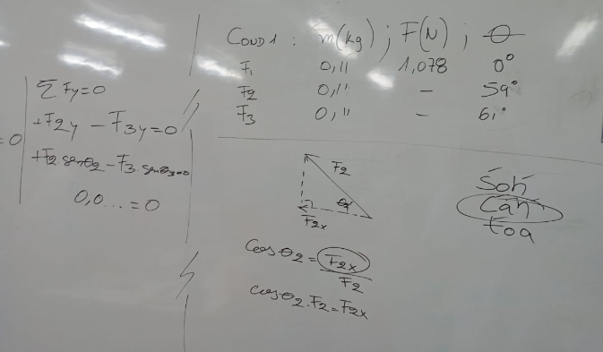
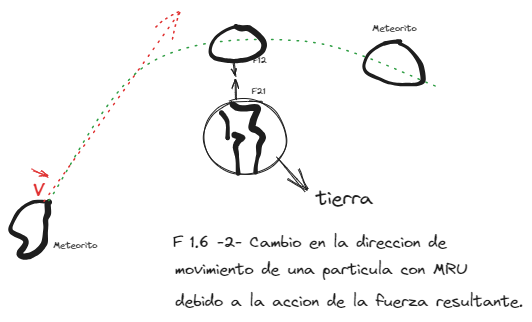
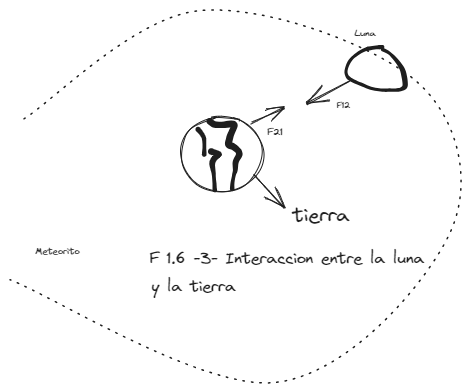
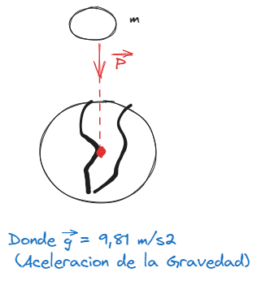
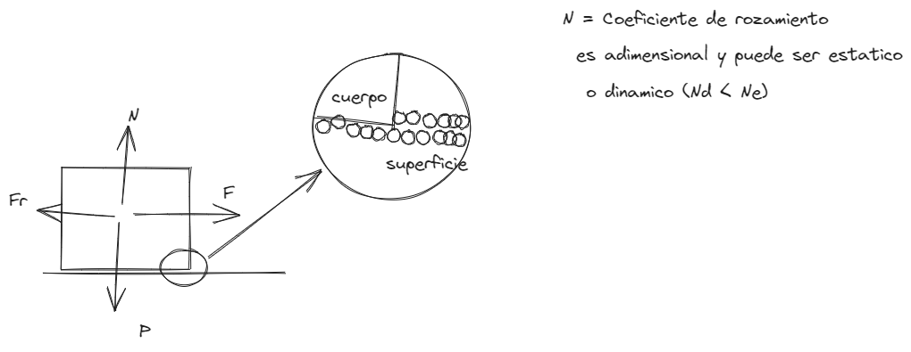

# [[Fisica 1 (Mecanica)]]
	- ## [[Primer Laboratorio]]
		- Ejercicio Practico de Equilibrio
			- {:height 279, :width 237} {:height 269, :width 382} {:height 293, :width 428}
			- 
	- ## [[Clase]]
		- ### Leyes de Newton
			- #### 2da Ley o Ley Fundamental de la Dinamica
				- Establece que si la fuerza resultante o neta sobre un punto material cualquiera no es nula, el mismo adquiere aceleracion y esta aceleracion es directamente proporcional a la fuerza resultante e inversamente proporcional a la masa, o sea:
					- $$\vec{a} = \frac{\vec{Fr}}{m} \rightarrow \vec{Fr} = m \times \vec{a}$$
					- <ins>Obs:</ins> Considerando que las fuerzas puedan descomponerse en sus componentes cartesianas, la ecuacion $$\vec{Fr}=m \times \vec{a}$$ pueden escribirse como
						- $$\vec{Fr_x}= m \times \vec{a_x}$$ $$\vec{Fr_y}= m \times \vec{a_y}$$
						- draws/2025-03-11-20-39-26.excalidraw
						- {:height 330, :width 532}
			- #### 3ra Ley o Principio de Accion y Reaccion
				- Establece que cada fuerza de accion le corresponde una fuerza de reaccion del mismo modulo, la misma direccion, pero en sentidos opuestos; estas fuerzas no se anulan entre si pues actuan en cuerpos distintos.
				- Matematicamente se expresa como
					- $$\vec{F_{12}} = -\vec{F_{21}} o \vec{F_{12}} + \vec{F_{21}} = 0 y |\vec{F_{12}}| = \vec{F_{21}}|$$
				- draws/2025-03-11-20-58-13.excalidraw
				- 
			- #### Caracteristicas de algunas fuerzas:
				- Fuerza Peso:
				  logseq.order-list-type:: number
					- Es la fuerza que ejerce la tierra sobre todos los objetos situados en el campo gravitatorio terrestre esta fuerza apunta siempre hacia el centro de la tierra y su modulo se considera constante en las proximidades de la superficie terrestres
						- $$\vec{P} = m \times \vec{g}$$
						- <ins>La fuerza peso siempre tiene la misma direccion y el mismo sentido que la aceleracion de la gravedad.</ins>
						- draws/2025-03-11-21-08-20.excalidraw
						- 
						- <ins>Obs</ins> Atendiendo la 3ra ley de Newton, la reaccion de la fuerza peso $$\vec{P}$$ es $$-\vec{P}$$ y es la fuerza que ejerce el cuerpo de masa "m" sobre la tierra y actua en el centro de la misma
				- Fuerza de Rozamiento (Por Deslizamiento):
				  logseq.order-list-type:: number
					- Es la fuerza que actua en sentido opuesto al movimiento o a la tendencia de movimiento, como consecuencia de la adhesion entre las moleculas del cuerpo y la superficie sobre la cual se encuentra.
						- PUEDE SER ESTATICA (CUANDO NO HAY MOVIMIENTO)
						  background-color:: red
						- Y DINAMICA (SI EXISTE MOVIMIENTO)
						  background-color:: green
					- draws/2025-03-11-21-19-59.excalidraw
					- 
					- $$Fr_E <= N_e \times N$$
					  $$Fr_d <= N_d \times N$$
					-