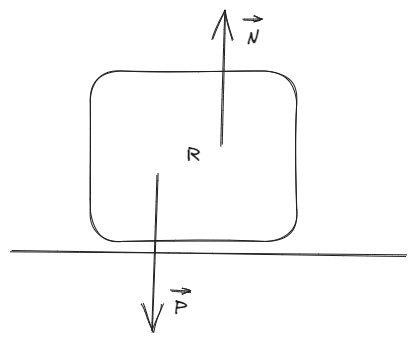
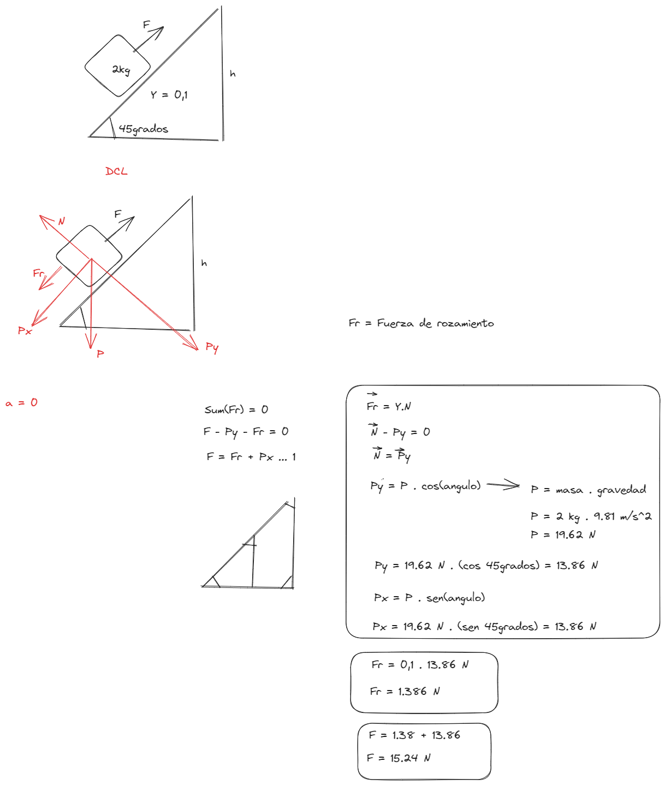

# [[Fisica 1 (Mecanica)]]
	- Parciales y Finales
		- Martes 01/04/2025 Primer Parcial
		- Martes 20/05/2025 Segundo Parcial
		- Martes 26/06/2025 Recuperatorio
		- Martes 05/07/2025 Examen Final
	- ## Fuerza de Apoyo (Normal)
		- draws/2025-03-18-18-44-19.excalidraw
		- 
	- # Fuerza de Rozamiento
		- draws/2025-03-18-18-46-31.excalidraw
		- 
		- $$Fr_E <= Y_E N$$
		- $$Fr_d <= Y_d N$$
		- La fuerza de rozamiento estatica varia entre ciertos limites $$0<=Fr_E<=Y_E N$$, es cero cuando el cuerpo estando en reposo no tiene ninguna tendencia de movimiento y es igual a $$Y_E N$$ cuando el mocimiento es inminente, llamado punto de destaque
		- Observacion: La fuerza normal se determina a partir de las fuerzas que actuan en el sistema o sobre los cuerpos. Algunos ejemplo son:
		- draws/2025-03-18-18-52-08.excalidraw
		- 
		-
	- ## Fuerza elastica
		- Si la fuerza que actua sobre un cuerpo le provoca una deformacion, pero una vez cesada la accion de la misma el cuerpo recupera su forma y dimension inicial , se dice que el mismo es un cuerpo elastico y a la fuerza se le denomina fuerza elastica. La experiencia mencionada se observa en los resortes .
		- La ley de HCOKE describe el comportamiento de la fuerza elastica y se enuncia "La fuerza recuperadora es directamente proporcional a la elongacion", 
		  $$F = - K \times x$$ Donde $$K$$ es la constante de elasticidad del resorte y la $$x$$ es la elongacion o deformacion.
		- Observacion: el signo negativo implica que la fuerza recuperadora y el deplazamiento o elongacion son de sentidos opuestos
		- draws/2025-03-18-19-12-32.excalidraw
		- 
	- ## Ejercicio
		- Un resorte se elonga 10 cm al aplicarle una fuerza de 10 N, la constante elasticidad del mismo en el S.I.. igual a:
			- a) 10
			- b) 200
			- c) $$10^2$$
			- d) $$10 \times \frac{1}{10} \times 10^5$$
			- e) 20 x $$10^{-2}$$
			- f) 0,2 x $$10^{-2}$$
				- [[draws/2025-03-18-19-36-34.excalidraw]]
	- ## Repaso de Conversiones
		- $$\frac{km}{h} \rightarrow \frac{m}{s}$$
		- $$S.O. \frac{km}{h} \rightarrow \frac{m}{s}$$
		- $$S.O. \ \frac[[2025_03_18]]$$
		- draws/2025-03-18-19-55-19.excalidraw
		- {:height 85, :width 258}
		-
		- $$S.O. \ \frac[[2025_03_18]]$$
		- $$S.O. \ \frac[[2025_03_18]]$$
		-
		- Observacion: se simplifican las medidas
		-
	- ## Ejercicio 2
		- El Modulo de la Fuerza $$\vec{F}$$ necesaria para levantar el cuerpo de la figura dada con M.U (Movimiento Uniforme), en $$[N]$$ es igual a:
			- a) 15,24
			- b) 1,56
			- c) 1,39
			- d) 13,86
			- e) 1,524
				- draws/2025-03-18-20-25-14.excalidraw
				- 
	- ## Ejercicio 3 (Repaso de Introduccion a la Fisica)
		- Atendiendo la figura dada y si g = 10 $$\frac{m}{s^2}$$ la tension en el hilo que une a los 2 cuerpos, en $$[N]$$, igual a:
			- a) todas las anteriores
			- b) ninguna
			- c) 4,08
			- d) b y c son correctas
			- e) todas las anteriores
			- f) 170,88 x $$10 \degree$$
			- g) 29,12
			- h) Nula
			- i) 64,08 -- Respuesta Correcta
				- draws/2025-03-18-20-52-36.excalidraw
				- 
				-
			-
		-
		-
		-
		-
-