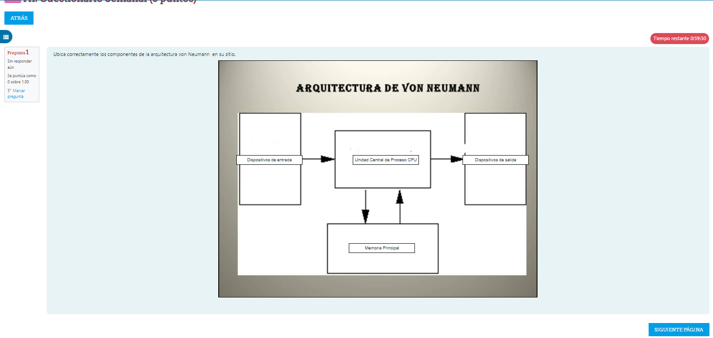
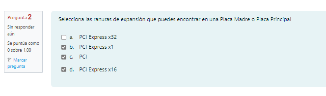
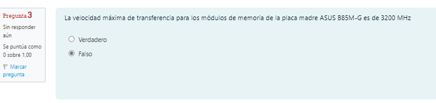
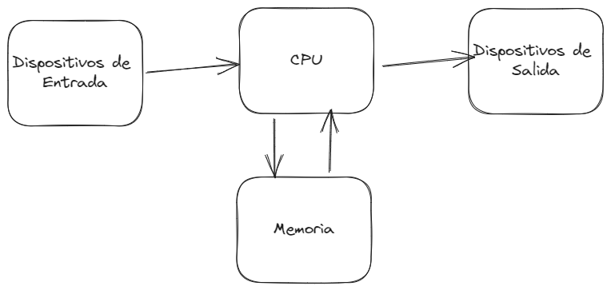
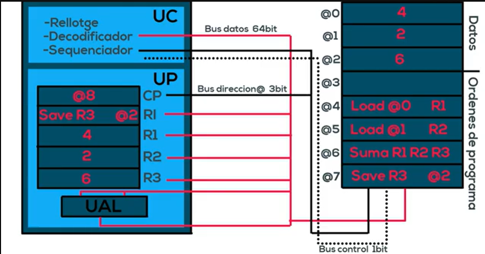
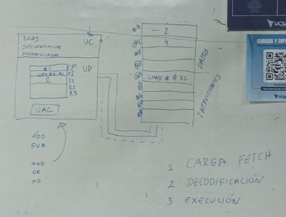
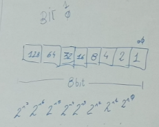
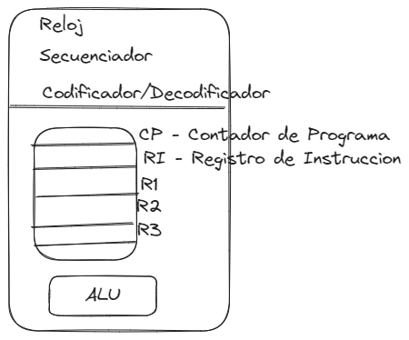

# [[Taller de Computadoras]]
	- [[2025_03_20]][[2025_03_19]]
	- 
	- 
	- ## [[Clase]]
		- Arquitectura Von Newmann
			- draws/2025-03-19-21-00-27.excalidraw
			- 
		- Funcionamiento de Von Newmann
			- {:height 411, :width 758}
			- 
			- 
			- Obs.
				- Carga - Fetch
				  logseq.order-list-type:: number
				- Decodificacion
				  logseq.order-list-type:: number
				- Ejecucion - Execution
				  logseq.order-list-type:: number
		- Se usa el Simulador 8085 para el ejemplo
			- draws/2025-03-19-21-14-11.excalidraw
			- 
			-
			-
			-
	-
-