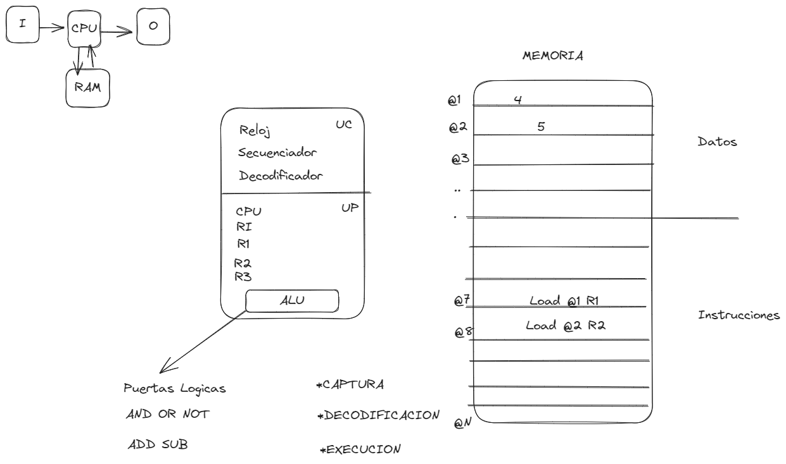

- [[Taller de Computadoras]]
	- Simulador
		- [8085 Simulator](https://8085.netlify.app/Intel8085)
		- draws/2025-03-26-19-15-59.excalidraw
		- 
		-
	- # [[Taller de Computadoras]]
		- arquitectura von newman
			- diagrama de siempre
		- cual es el funcionamiento en tiempo de ejecucion
			- hay una captura de datos que se llama FETCH
			- despues viene la decodificacion que se hace dentro del procesador
			- despues viene la ejecucion, va al ALU donde estan las logicas AND OR NOT ADD SUB
		- Pregunta de examen
			- CAPTURA (FETCH)
			- decodificacion
			- Execucion
		- cuando la arquitectura von newman logro que los datos y las instrucciones se puedan insertar en la memoria , la computadora se volvio de uso general
		- Los elementos son
			- Unidad de Control
				- Reloj
				- Secuenciador
				- Decodificador
			- Unidad de Procesamiento
				- Registros
				- Unidad Aritmetico Logica (ALU)
		- Se carga dentro del procesador la instruccion para que sea mas eficiente, fisicamente, luego ocurre los procesos FETCH, Deco y Execucion
		- luego de eso lee el dato y va al secuenciador para enviar al ALU o a la memoria secundaria (ese punto se llama ejecucion)
		- el contador de programa aumenta en cada ciclo de ejecicion, pisa la nueva instruccion
		- R1, R2 y R3, es donde se almacena los resultados de las ejecuciones, hasta que encuentre la instruccion END
-