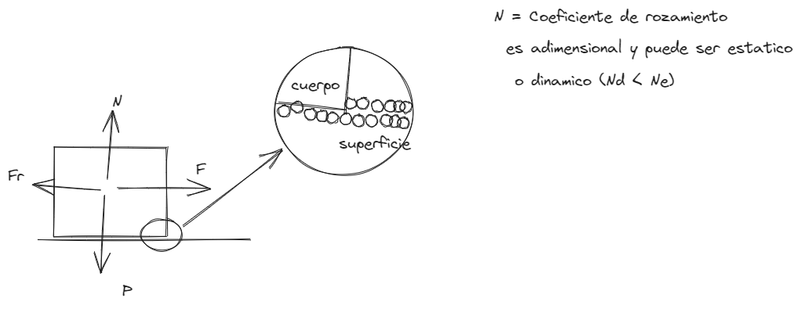

# [[Fisica 1 (Mecanica)]] Resumen
	- ## Formulario
		- ### Primera Ley de Newton - Inercia
			- $$\sum \vec{F} = 0 \ \text{ó} \ \vec{F}r = 0 \rightarrow \vec{a} = c \left\{ \begin{matrix}\text{Reposo} \\ \text{MRU} \end{matrix} \right\}$$
			- La suma de todas las fuerzas es igual a 0 $$\sum FR = 0$$
			- P = Tierra = Suelo (Siempre depende del observado)
		- ### Estatica (Torque o momento de una fuerza equilibrio de los cuerpos)
			- $$M = r \cdot F \cdot \sin \theta$$
				- O -> punto por donde pasa el eje de la rotacion de la fuerza
				  A -> punto de la aplicacion de la fuerza
				  .$$\vec{r}$$ -> vector de posicion
				  b -> brazo de palanca de la fuerza
				- El Ecuacion $$M = (F \cdot \sin \theta ) \cdot r = F y \cdot r = F ( r \cdot \sin \theta ) = F \cdot b$$ , donde la ultima expresion $$M = F \cdot b $$ es utilizada frecuentemente para el calculo de momento
		- ### Condiciones de Equilibrio
			- 
		- #### 2da Ley o Ley Fundamental de la Dinamica
			- Establece que si la fuerza resultante o neta sobre un punto material cualquiera no es nula, el mismo adquiere aceleracion y esta aceleracion es directamente proporcional a la fuerza resultante e inversamente proporcional a la masa
				- $$\vec{a} = \frac{\vec{Fr}}{m} \rightarrow \vec{Fr} = m \times \vec{a}$$
				- <ins>Obs:</ins> Considerando que las fuerzas puedan descomponerse en sus componentes cartesianas, la ecuacion $$\vec{Fr}=m \times \vec{a}$$ pueden escribirse como
					- $$\vec{Fr_x}= m \times \vec{a_x}$$ $$\vec{Fr_y}= m \times \vec{a_y}$$
					-
		- #### 3ra Ley o Principio de Accion y Reaccion
			- Establece que cada fuerza de accion le corresponde una fuerza de reaccion del mismo modulo, la misma direccion, pero en sentidos opuestos; estas fuerzas no se anulan entre si pues actuan en cuerpos distintos.
			- Matematicamente se expresa como
				- $$\vec{F_{12}} = -\vec{F_{21}} o \vec{F_{12}} + \vec{F_{21}} = 0 y |\vec{F_{12}}| = \vec{F_{21}}|$$
	- ## Teoria:
		- Un punto material o masa puntual se define como un cuerpo de dimensiones despreciables, considerando las distancias envueltas en el problema. No debe interpretarse como masa o peso despreciable.
		- Para el analisis se enfoca las <ins>**CAUSAS**</ins> que provocan el movimiento de los cuerpos, es decir,
			- - La fuerza que actuan en las mismas
		- ### Definiciones
			- Masa:
			  logseq.order-list-type:: number
				- Es una propiedad inherente a la materia (**Existe, la materia, luego existe la masa**), es una magnitud escalar y es fundamental en el **SI** (Sistema Internacional).
			- Fuerza:
			  logseq.order-list-type:: number
				- Es la interaccion entre los cuerpos, es una magnitud vectorial que actuando sobre un cuerpo puede provocar aceleracion escalar, angular o deformacion en el **SI** Se mide en **Newton** (**N**)
			- Inercia:
			  logseq.order-list-type:: number
				- Es una propiedad de los cuerpos relacionada con la masa, de resistirse al cambio de un estado de reposo o del movimiento rectilineo uniforme (**MRU**)
			- Sistema Inercial de referencia:
			  logseq.order-list-type:: number
				- Cuando hablamos que una particula se encuentra en movimiento o en reposo nos referimos siempre a un sistema de referencia, dado un observador "O" puede estar estudiando la particula en su movimiento o en reposo a su vez.
			- Diagrama del cuerpo Libre:
			  logseq.order-list-type:: number
				- Es un esquema basico donde se indican, sobre cada cuerpo, las fuerzas que actuan (como su peso normal, tension, etc.). Sobre el mismo se escriben las ecuaciones correspondientes a cada cuerpo, de forma independiente, es decir, como si los otros cuerpos no existiesen como muestra en los siguientes ejemplos.
				- {:height 220, :width 718}
				-
		- ### Marco de Referencia Inerciales
			- Un marco de referencia en el que es valida la primera ley de Newton, es un marco de referencia inercia hacia la **TIERRA** y se la conoce como la ley de inercia.
			- El analisis del marco es importante establecer el **CRITERIO** del **OBSERVADOR** "O", en como relaciona las fuerzas por donde y como efectuan.
		- #### Caracteristicas de algunas fuerzas:
			- Fuerza Peso:
			  logseq.order-list-type:: number
				- Es la fuerza que ejerce la tierra sobre todos los objetos situados en el campo gravitatorio terrestre esta fuerza apunta siempre hacia el centro de la tierra y su modulo se considera constante en las proximidades de la superficie terrestres
					- $$\vec{P} = m \times \vec{g}$$
					- <ins>La fuerza peso siempre tiene la misma direccion y el mismo sentido que la aceleracion de la gravedad.</ins>
					- draws/2025-03-11-21-08-20.excalidraw
					- 
					- <ins>Obs</ins> Atendiendo la 3ra ley de Newton, la reaccion de la fuerza peso $$\vec{P}$$ es $$-\vec{P}$$ y es la fuerza que ejerce el cuerpo de masa "m" sobre la tierra y actua en el centro de la misma
			- Fuerza de Rozamiento (Por Deslizamiento):
			  logseq.order-list-type:: number
				- Es la fuerza que actua en sentido opuesto al movimiento o a la tendencia de movimiento, como consecuencia de la adhesion entre las moleculas del cuerpo y la superficie sobre la cual se encuentra.
					- PUEDE SER ESTATICA (CUANDO NO HAY MOVIMIENTO)
					  background-color:: red
					- Y DINAMICA (SI EXISTE MOVIMIENTO)
					  background-color:: green
				- draws/2025-03-11-21-19-59.excalidraw
				- 
				- $$Fr_E <= N_e \times N$$
				  $$Fr_d <= N_d \times N$$
		- ### Ejercicios
			- [[2025_02_25]]
			-
			-
		-