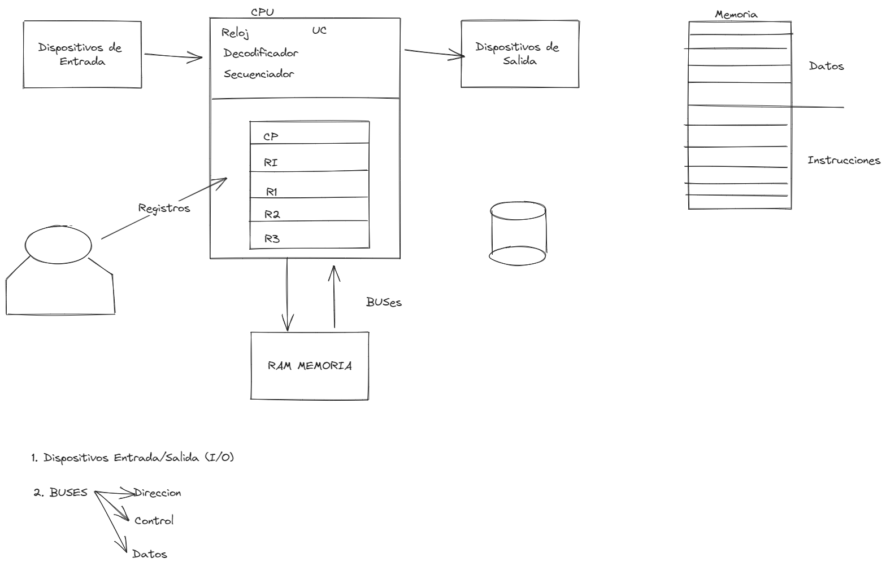
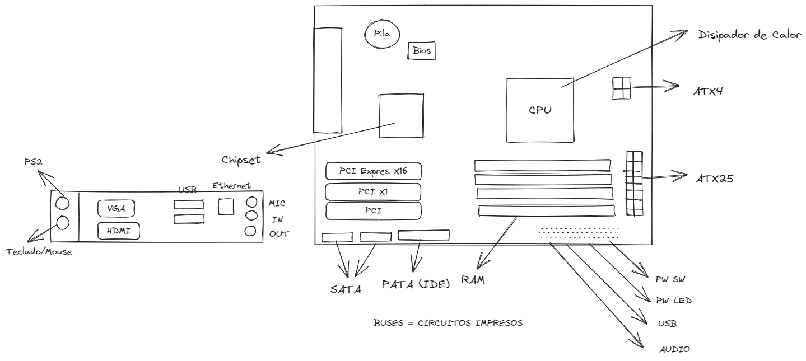

# [[Taller de Computadoras]]()
	- ## Arquitectura Von Neumann
		- draws/2025-04-02-18-49-29.excalidraw
		- 
		- La mayor contribucion de la Arquitectura Von Neumann es que a partir de su implementacion la computadora se vuelve a proposito general.
		- Con la arquitectura von neumann se pueden almacenar instrucciones y datos en la memoria (Tema de Examen)
		- Los perifericos son todo lo que se conecta a la computadora, existen los de entrada, salida y mixto.
		- draws/2025-04-02-19-07-11.excalidraw
		- 
		-
		-