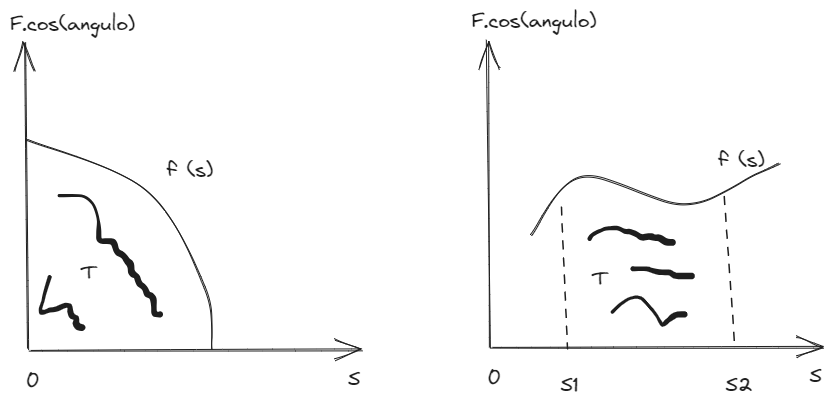

# [[Fisica 1 (Mecanica)]]
	- ## [[Trabajo]], Potencia y Energia
		- ### [[Trabajo]] y Potencia
			- Se dice que se realiza [[Trabajo]] sobre un cuerpo cuando una fuerza puede vencer una resistencia a lo largo de un camino, esta magnitud combina o involucra a una fuerza y un desplazamiento , pero es una cantidad escalar, es decir solo requiere de un valor numerico y la unidad de medida correspondiente para su definicion.
			- El [[Trabajo]] puede ser positivo o negativo es (+) positivo cuando la fuerza favorece al movimiento y es (-) negativo cuando la misma actua en sentido opuesto
			- **Para una fuerza constante, el [[Trabajo]] es igual al producto del desplazamiento de la particula por la componente de la fuerza a lo largo del desplazamiento**
				- $$T = F \times S \times \cos{(\alpha)} \\ \text{Se mide en [J] Joule}$$
					- .$$S$$ = Distancia Recorrida
					- .$$F$$ = Accion de la Fuerza
					- .$$\alpha$$ = Es la direccion de la fuerza en relacion al desplazamiento
				- **Observacion:** De la ecuacion se deduce que las fuerzas perpendiculares al movimiento, como la fuerza centripeta en el movimiento circular o la fuerza peso de un cuerpo cuando este se mueve en una superficie horizontal, no realizan trabajo ya que $$\cos{(90 \degree)} = 0$$ y hace nulo el valor de $$T$$
			- Si se conoce la representacion grafica de la componente de la fuerza paralela al desplazamiento, se puede determinar el [[Trabajo]] de la fuerza, ya que esta determinado por el **area bajo la curva**.
				- draws/2025-04-08-20-53-50.excalidraw
				- 
		- ### [[Trabajo]] y Potencia
			- La potencia de define como el [[Trabajo]] hecho en la unidad de tiempo, asi la potencia media es:
			- \begin{align*}
			  P &= \frac{T}{\Delta t} \quad \text{o bien} \quad P = (F \times \cos{\alpha}) \times U_m, \\
			  &\text{donde } U_m \text{ es la velocidad media en el intervalo } \Delta t. \\
			  \text{La potencia instantánea es: } P &= (F \times \cos{\alpha}) \times V, \\
			  &\text{donde } V \text{ es la velocidad instantánea}.
			  \end{align*}
			- ### Unidades de [[Trabajo]] y energia:
				- El [[Trabajo]]
					- En el (S.I) se expresa como Newton Metro unidad conocida po **JOULE** Abreviado $$J$$
						- $$J = N \times m = Kg \times m^2 \times s^{-2}$$
				- La Potencia
					- En el (S.I) se expresa e **WATT** y abreviado **W**
						- $$W = J \times s^{-1} = Kg \times m^2 \times s^{-3}$$
				- Equivalencias:
					- Kilowatt (kw) = 1kW = 10^3 W
					- Megawatt (Mw) = 1Mw = 10^6 W
					- Gigawatt (Gw) = 1Gw = 10^9 W
					- Observacion:
						- Caballo de fuerza (hp) = 745,7 W
						- K.W.H (Kilowatt Hora) = 3,6.10^6 j
						- 1 CU = 735,5 W
			-
	- ## [[Formulario Fisica 1 (Mecanica]]
		- $$T = F \times S \times \cos{(\alpha)} \\ \text{Se mide en [J] Joule}$$
		-