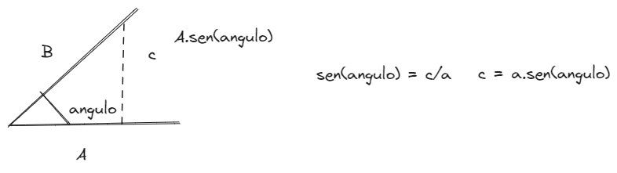
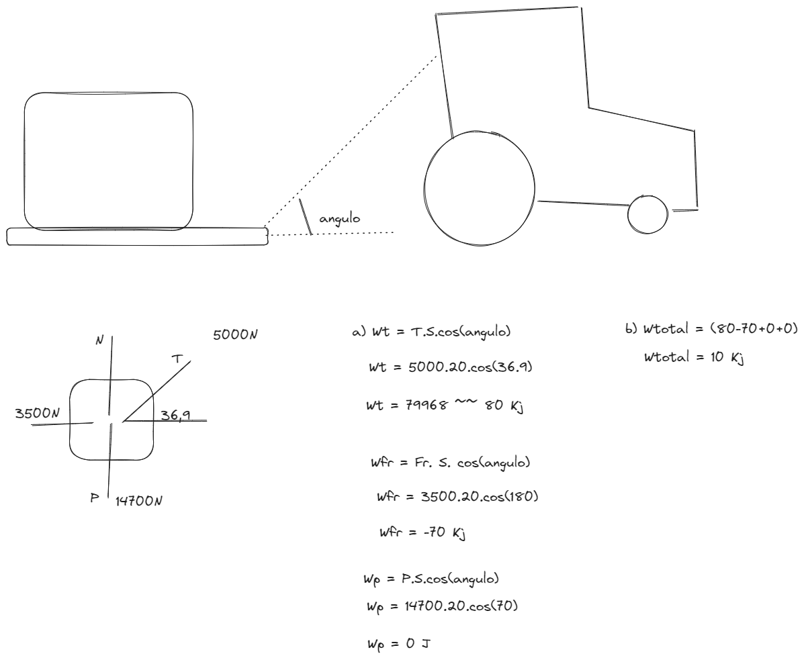

# [[Fisica 1 (Mecanica)]]
	- ## Trabajo y Potencia
		- Sabiendo el producto escalar
			- $$\vec{A} \times \vec{b} = A \times B \times \cos{\theta} = Ax \times Bx + Ay \times By + Ay \times By$$
		- Se deduce que:
			- $$W = \vec{F} \times \vec{S} = F \times S \times \cos{\theta} = Fx \times Sx + Fy \times Sy +Fz \times Sz$$
			  $$(\text{Fuerza constante, desplazamiento rectilineo})$$
		- ### Ejercicio:
			- Esteban ejerce una fuerza constante de magnitud 210 N (aproxi 47 Lb) sobre el automovil averiado, mientras lo empuja una distancia de 18 m. Ademas, un neumatico, se desinflo, asi que, para lograr que el auto avance al frente, Esteban debe empujarlo con un angulo $$30 \degree$$ con respecto a la direccion del movimiento; 
			  logseq.order-list-type:: number
			  a) Cuanto [[Trabajo]] efectua Esteban?, 
			  b) con animo de ayudar, esteban empua un segundo automovil averiado con una fuerza constante
			             $$\vec{F} (160 N) i - (40N) j ; \vec{S}=(14m)i + (11m) j$$
				- F = 210N
				- S = 18 m.
				- .$$\theta = 30 \degree$$
				- W = ?
				- a) W = 210.18.cos(30) = 3273.57 Joule
				-
				- b) W = 160.14 - 40.11
				- W = 1800 Joule
				-
				- draws/2025-04-15-18-46-00.excalidraw
				- 
	- ## [[Trabajo]] Total
		- $$W_{Total} = ( \sum{\vec{Fr}}) \times \vec{S}$$
		- ### Ejercicio:
			- 2. Un Granjero engancha su tractor a un trineo cargado con leña y lo arrastra 20 m sobre el suelo horizontal, el peso total del trineo y la carga es de 14700 N. El tractor ejerce una fuerza constante de 5000 N a $$36,9 \degree$$ sobre la horizontal, como se indica en la figura. Un fuerza de friccion de 3500 N se opone al movimiento del trineo.
			  Calcule El [[Trabajo]] realizado por cada fuerza que actua sobre el trineo y el [[Trabajo]] total de todas las fuerzas.
				- draws/2025-04-15-19-13-10.excalidraw
				- {:height 991, :width 1197}
				- S = 20 m
				- F = 14700 N
				- F = -5000 N
				- Fr = 3500 N
				- La fuerza peso y la normal es igual a cero, tema de examen
			- 3. Un cuerpo de 100 N se eleva a una altura de 10 m. con M.U. , por la accion de una fuerza que realiza un [[Trabajo]] total a
			  a) 1000 ergios   b) 100 j   **c) 1000 j**     d) 1000Kgm      e) 100 ergios
				- F = 100N
				- S = 10m
				- M.U = a = 0
				         V = constante
				- Fr = 0
				  P = N
				  N = 100N
				- W = 100.10 = 1000j **c)**
	- # Energia
		- ## Energia Cinetica
			- Consideremos la accion de una fuerza resultante constante sobre un cuerpo que se mueve a lo largo de una trayectoria $$S$$. El trabjo realizado considerando $$Fn$$, como la proyeccion de la fuerza en la direccion del desplazamiento y $$d$$ la distancia recorrida se expresa como:
			  $$T = F_n \times d$$
			- Entonces a partir de la $$2^{\text{nda}}$$ Ley de Newton podemos escribir:
			  $$T = m \times a \times d$$
			- Luego reemplazamos por la ecuacion de Torriccelli que relaciona la velocidad de un movil como:
			  $$V^2 = V_o^2 + 2 \times a \times d$$
			- Se observa que es posible despejar $$a \times d$$ y reemplazar por la ecuacion de trabajo:
			  $$T = \frac{1}{2} \times m ( V^2 - V_0^2) = \frac{1}{2} \times m \times V^2 - \frac{1}{2} \times m \times V_0^2$$
			  La cantidad $$\frac{1}{2} \times m \times V^2$$ se conoce como **EC = Energia Cinetica**
			- Nota: **Para que haya Energia tiene que haber [[Trabajo]] en movimiento**
			- Finalmente se escribe:
				- $$T = \Delta EC$$
			- Es ecuacion indica que el [[Trabajo]] hecho por la fuerza que actua sobre la particula es igual al cambio de su energia cinetica a esta expresion se le conoce como el teorema del [[Trabajo]] y la energia o teorema de las fuerzas vivas
			- Observacion: $$1_{ev} (Electrovolt) = 1,6.10^{-19} j$$
			- ## Ejercicio:
				- El [[Trabajo]] neto realizado para detener una particula de 5g que se mueve inicialmente de 72 km/h es, en el S.I.:
				  logseq.order-list-type:: number
					- a) -2   b) -1  c) 2  d) 1   e) -0.05  f) n.d.a
					- $$T = \Delta \times E \times C$$
					- $$T = \frac{1}{2} \times m \times V_f^2 - \frac{1}{2} \times m \times V_0^2$$
					- $$T = - \frac{1}{2} \times m \times V_0^2$$
					- $$T = - \frac{1}{2} \times 20^2 \times (5 \times 10^{-3})$$
					- $$T = - 1$$
				- Un Atleta levanta una pesa de 150 kg a una altura de 2 m y la sostiene sobre su cabeza durante 5 segundos, la potencia en watts que desarrola mientras sostiene la pesa sobre sobre su cabeza. es
				  logseq.order-list-type:: number
				  a) 600 b) 60  c) 30  d) 300 e) 6000 f) 0
					- R = como el objeto esta sostenido no hay movimiento ni fuerza, la respuesta es cero. **f)**
					-
	- # Notas:
		- Potencia no es lo mismo que Energia Cinetica, se pone por error Watts en lugar de Joules
		- Repaso de Conversiones:
			- $$\frac{75 km}{h} \times \frac{1000m}{1cm} \times \frac{h}{3600s} = \frac{72 x 1000}{3600} = 20 \frac{m}{s}$$
			- $$\frac{5 g}{} \times \frac{1 kg}{1000 g} = \frac{5}{1000} = 5 x 10^{-3}$$
			-
		-