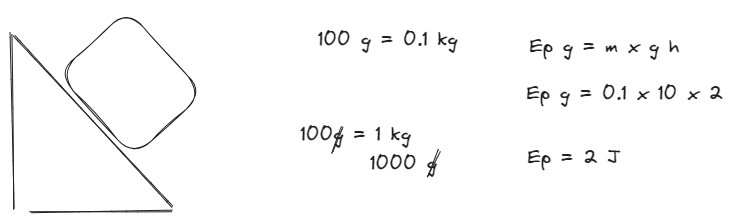
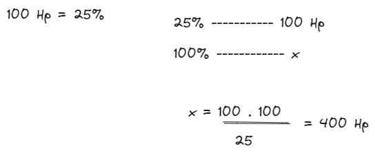
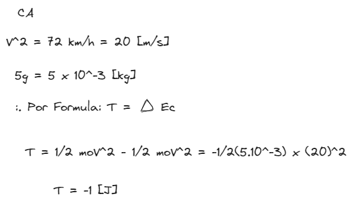
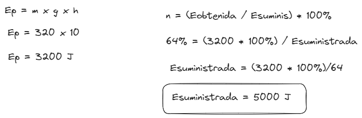
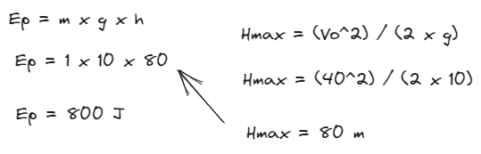
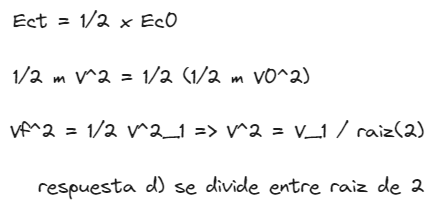

# [[Fisica 1 (Mecanica)]]
	- ## Energia potencial y fuerza conservativa
		- una fuerza es conservativa si su dependencia del vector posicion $$\vec{r}$$ de la particula es tal que el trabajo realizado por la fuerza se puede expresar como la diferencia entre una magnitud $$E_p (r)$$ evaluada en los puntos inicial y final, sin importar la trayectoria seguida por la particula.
		- la $$E_p (r)$$ se conoce como energia potencial y solo es funcion de la posicion de la particula
		  $$\therefore$$   $$T = E_p (A) - E_p (B) = \text{Energia Inicial - Energia Final}$$
		- El [[Trabajo]] de una fuerza conservativa se puede calcular sin hacer referencia alguna a la trayectoria seguia, es decir $$T = - \Delta E_p$$
		- El trabajo de la fuerza conservativa a lo largo de cualquier trayectoria es $$\text{Cero "0"}$$
		- Recordando que la energia cinetica es $$\frac{1}{2} m \times V^2$$ y el teorema del trabajo y la energia $$T= \Delta \times E_c$$ siempre es valida
		- Por otro lado $$T = E_p (A) - E_p(B)$$ solo puede usarse cuando la fuerza es conservativa.
		- Son fuerzas conservativas son :
			- Fuerza Gravitatoria
			- Fuerza Elastica
		- -----------------
		- Existe una relacion matematica importante entre la fuerza y la energia potencial 
		  $$\boxed{F = - \frac{lim}{\Delta s \rightarrow 0} \frac{\Delta E_p}{\Delta S}}$$
		- Energia potencial
		  $$\boxed{E_p = m \times g \times h}$$
		- Energia elastica
		  $$\boxed{E_p = \frac{1}{2} \times K \times x^2} \text{; donde } x \text{ es la deformacion experimentada del resorte}$$
	- ## Conservacion de la energia de una particula
		- Cuando la fuerza que actua sobre una particula es conservativa, se combinan las ecuaciones $$T = \Delta E_c$$ y $$T = - \Delta E_p$$ y se obtiene $$\Delta (E_c + E_p) = 0$$
		- La cantidad $$\boxed{E_c + E_p = E_m}$$ se conoce como energia total de la particula o "Energia Mecanica"
		- En un sistema donde la fuerza resultante es conservativa la variacion de la energia mecania "**es nula**", o lo que es lo mismo la energia <ins>mecanica permanece constante</ins>
		  Asi para cualquier posicion
		  $$\boxed{(E_c + E_p)_A = (E_c + E_p)_B} \text{; donde el punto A y B son posiciones cualquiera de la particula}$$
	- ## Fuerzas no conservativas y disipacion de energia
		- En la naturaleza encontramos fuerzas no conservativas como por ejemplo la friccion
			- La friccion por deslizamiento siempre se opone al desplazamiento, su trabajo depende de la trayectoria seguida
			  $$\therefore T_+ = - \Delta E_p + T_\text{no conservativo}$$
			  pero el $$T_+ = \Delta E$$
			  $$\rightarrow \boxed{\Delta E_c + \Delta E_p = T_\text{no conservativo}} \text{--->} \Delta ( E_c + E_p) = \Delta E_m \neq 0$$
	- ## Rendimiento
		- El eficiencia energetica de un dispositivo, maquina, ciclo termodinamico expresa el cociente
			- $$n = \frac{\text{Energia Obtenida}}{\text{Energia Suministrada}} = \frac{T \text{  Obtenido}}{T \text{  Suministrado}}$$
			- En terminos porcentual es
				- +$$n = \frac{E_\text{Obtenida}}{E_\text{Suministrada}} \times 100  $$ %
		- ### Ejercicio
			- La potencia maxima del motor de un automovil es de 5 Hp. Si tiene una perdida de 1 Hp es correcto afirmar que su rendimiento es igual a:
			  logseq.order-list-type:: number
			  a) 0.2 b) 0.5 c) 0.8 d) 1 e)
				- $$P_\text{total} = 5 Hp$$ ; $$P_\text{disipada} = 1 Hp$$
				  $$P_\text{obtenida} = P_\text{total} - P_\text{disipada}  = 5-1 = 4 \ Hp$$
				  $$n = \frac{P_\text{Obtenida}}{P_\text{Suministrada}} = \frac{4}{5} = 0.8 = 0.8 \times 100 % = 80%$$
				  $$P_\text{suministrada} = P_\text{total}$$
			- Una particula de 100 g desciende por un plano inclinado liso de 30$$\degree$$. la altura del plano es de 2m, considerando g=10 $$\frac{m}{s^2}$$. El trabajo realizado sovre la partiucla por la accion de la gravedad es, en $$J$$ igual a:
			  logseq.order-list-type:: number
			  a) 1000 b) 500 c) 2000 d) 2 e) 1
				- draws/2025-04-29-20-28-10.excalidraw
				- 
				-
			- Una maquina tiene un rendimiento de 75% y desaprovecha 100 Hp la potencia total de la maquina es igual a:
			  logseq.order-list-type:: number
			  a) 25 Hp b) 133.33 Hp c) 75 Hp d) 400 Hp e) 150 Hp
				- draws/2025-04-29-20-32-52.excalidraw
				- {:height 237, :width 544}
				-
			- El trabajo neto realizado para detener una particula de 5g que se mueve inicialmente a una velocidad de 72 $$\frac{km}{h}$$ es, en el S.I. igual a:
			  logseq.order-list-type:: number
			  a) -2 b) -1 c) 2 d) 1 e) -0.05
				- draws/2025-04-29-20-40-45.excalidraw
				- {:height 345, :width 580}
			- Con una polea Juan levanta un peso de 320N a 10m de altura. Si el sistema tiene un rendimiento de 64%. El [[Trabajo]] realizado por Juan, en el S.I. es:
			  logseq.order-list-type:: number
			  a) 3200 b) 5000 c) 2048 d) 160 e) 8.888
				- draws/2025-04-29-20-46-33.excalidraw
				- 
			- Se lanza una particula de 1kg verticalmente hacia arriba desde el suelo, con una velocidad $$V_0 = 40 \frac{m}{s}$$ considerando $$g = 10 \frac{m}{s^2}$$
			  logseq.order-list-type:: number
			  La energia mecanica en el punto más alto vale:
			  a) 800 J b) 400 J c) 1600 J  d) 20 J e) 80 J
				- draws/2025-04-29-20-55-53.excalidraw
				- 
			- Una particula posee una $$E_\text{c0}$$ al desplazarse sobre una superficie horizontal. Si luego la energia cinetica se reduce a la mitad, la velocidad se:
			  logseq.order-list-type:: number
			  a) duplica b)multiplica por 4 c) multiplica por $$\sqrt{2}$$ d) divide entre $$\sqrt{2}$$ e) se reduce la cuarta parte
				- draws/2025-04-29-21-06-03.excalidraw
				- 
			-
	- ## Notas de [[Clase]]:
	- Trayectoria = puntos suscesivos que marca una distancia recorrida escalar
	- Desplazamiento es un vector y el otro es escalar
	- El [[Trabajo]] se mide en Joules, la potencia en Watts
	- El segundo parcial el error ocasional es no distinguir entre joules y watts
	- puede salir en el parcial cuando la energia mecanica es nula
	- ejercicios 6 y 7 para el final