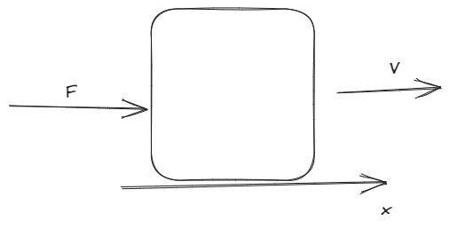

# [[Fisica 1 (Mecanica)]]
	- Martes 20/05/2025
		- [[Trabajo]]
		- Energia
		- Fuerza conservativa
		- Impulso
		- Cantidad de movimiento
	- Martes 13/05/2025
		- Jornadas Academicas (Online)
		- Charla Taller de IA
		- Arquitectura de una IA
	- ## [[Clase]]
		- ### Impulso de una Fuerza
			- Cuando pateamos una pelota, damos un golpe de puño o hacemos rebotar una pelota contra la pared, en todos estos casos estamos aplicando una fuerza durante un determinado tiempo sobre un cuerpo, decimos, comunmente que aplicamos un **IMPACTO** sobre el cuerpo.
			- El impulso $$I$$ de una fuerza $$F$$ Aplicada sobre un cuerpo de masa $$m$$ durante un tiempo $$\Delta t$$, se define como el producto entre $$F$$ y $$\Delta t$$ siendo $$I$$ una magnitud vectorial
			  $$\boxed{\vec{I} = \vec{F} \times \Delta t}$$
			  Unidades
			- $$M \cdot k \cdot s \text{ ó } SI = [I] = N \times s$$
			  $$[I] = kg \times \frac{m}{s} \text{    ->Relacion masa con la velocidad}$$
			- Para el Impulso vale el **principio de superposicion**
			  Si sobre un cuerpo se aplican "n" fuerzas durante un intervalo de tiempo $$\Delta t$$ entonces el impulso aplicado es la suma del impulso realizado por cada fuerza
			  $$
			  \vec{I}_{\text{total}} = \sum_{i=1}^{n} \vec{I}_1
			  $$
			- Casos Ejemplos
				- A. Si se quiere detener completamente, en el mismo tiempo $$\Delta t$$, a un objeto (Camion) de masa "M" y a un automovil de masa "m" (m<M), ambos moviendose a la misma velocidad "V"; sabemos que la fuerza que debemos aplicar al camion es mayor que la que debemos aplicar al automovil.
				- draws/2025-05-06-19-01-58.excalidraw
				- 
				- $$
				  \left.
				  \begin{aligned}
				  F_c &= M \times \frac{V}{\Delta t} \\
				  F_A &= M \times \frac{V}{\Delta t}
				  \end{aligned}
				  \right\}
				  \quad \quad
				  F_c > F_A
				  $$
				- Se puede observar que la fuerza necesaria para detenerlos completamente depende de la velocidad y masa del cuerpo
		- ### Cantidad de movimiento
			- La cantidad de movimiento "P" de un cuerpo de masa "m" moviendose a la velocidad "V", se define como el producto entre "m" y "v" siendo $$\vec{P}$$ una magnitud vectorial
			  $$\boxed{\vec{P} = m \times \vec{V}}$$
			  <ins>Unidades</ins>
			  $$[MASA] \times \frac{[Longitud]}{[Tiempo]} = [P] = kg \times \frac{m}{s}$$
			  <ins>Obs</ins> Se puede observar que impulso y cantidad de movimiento tienen la misma unidades lo que estaria indicando que ambas pueden estar relacionadas.
		- ### Conservacion de la cantidad de movimiento
			- Veamos la relacion entre $$\vec{I}$$ y $$\vec{P}$$ mediante un ejemplo, supongamos un cuerpo de masa constante "m" que se muece con velocidad $$\vec{V}$$ y se aplica una fuerza $$\vec{F}$$ durante un tiempo $$\Delta t$$
				- [[draws/2025-05-06-19-29-06.excalidraw
				- 
				- Por dinamica $$\vec{F} = m \times \vec{a}$$
				  Por cinematica $$\vec{a} = \frac{\Delta \vec{V}}{\Delta t}$$
				  Reemplazando $$\vec{F} = m \times \frac{\Delta \vec{V}}{\Delta t}$$
				  Si $$m = te$$ ---> $$\vec{F} = \frac{\Delta \times (\Delta \vec{V})}{\Delta t}$$
				  y finalmente $$\vec{F} \times \Delta t = \Delta \times (\Delta \vec{V})$$
				  $$\boxed{\vec{I} = \Delta \vec{P}}$$
				  $$\text{Esta relacion nos dice que el impulso aplicado a un cuerpo es igual a la variacion de la cantidad de movimiento del cuerpo}$$
				- <ins>Observacion</ins>
				- Si sobre un cuerpo no hay fuerzas aplicada a la resultante es, entonces la cantidad de movimiento del cuerpo es constante (1ra Ley de Newton)
				- Si $$\boxed{\sum{\vec{F}_{Ext}} = 0 \quad -> \vec{I} = 0 -> \vec{\Delta P} = 0 -> \vec{P} = 0 \quad \vec{V} = te}$$
				- Si sobre un cuerpo la fuerza neta aplicada no es nula entonces su cantidad de movimiento no es constante, decir la cantidad de movimiento del cuerpo despues de aplicar la fuerza es distinta a la que tenia inicialmente (2da Ley de Newton)
				- Si $$\boxed{\sum{\vec{F}_{Ext}} \neq 0 \quad -> \vec{I} \neq 0 -> \vec{\Delta P} \neq 0 -> \vec{P} \neq 0 \quad \vec{V} \neq te}$$
				- A partir de estas observaciones se puede anunciar el **Teorema de la conservacion de la cantidad de movimiento**
				- **SI SOBRE UN CUERPO DE MASA CONSTANTE SE APLICAN FUERZA TAL QUE LA FUERZA RESULTANTE ES NULA ENTONCES LA CANTIDAD DE MOVIMIENTO DEL CUERPO NO VARIA, ES DECIR, SU VELOCIDAD PERMANECE CONSTANTE**
			- ### Ejercicio
				- A un cuerpo de masa 10kg moviendose con una rapidez de 25 $$\frac{m}{s}$$ se aplica una fuerza de 5000 N durante 10 milisegundos, en la misma direccion y sentido del movimiento. Cual es la velocidad del cuerpo despues de la fuerza aplicada?
				- [[draws/2025-05-06-20-30-08.excalidraw
				- 
				- $$I = F \times \Delta t$$
				- $$I = 5000 \times 0.01 s$$
				- $$I = 50 N \cdot s$$
				- ----------
				- $$I = \Delta P$$
				- $$P = m \times \Delta V$$
				- $$50 N \cdot s = 10 \times \Delta V$$
				- $$\frac{50 N \cdot s}{10} = \Delta V$$
				- $$0.5 \frac{m}{s} = \Delta V$$
				- ------------
				- $$V_{\text{Final}} = V_{\text{Inicial}} + \Delta V$$
				- $$V_{\text{Final}} = 25 \frac{m}{s} + 0.5 \frac{m}{s}$$
				- $$V_{\text{Final}} = 30 \frac{m}{s}$$
				- 2 . Una Pelota de tenis de 0.057 kg se mueve horizontalmente a una velocidad de 50 $$\frac{m}{s}$$ y es golpeada por una raqueta, la raqueta ejerce una fuerza sobre la pelota en la direccion opuesta a su movimiento inicial durante un tiempo de 0.01 segundos, provocando que la pelota rebote con una velocidad de 40 $$\frac{m}{s}$$ en la direccion opuesta calcula la magnitud del impulso ejercido por la raqueta sobre la pelota
					- $$  P_{\text{Inicial}} = m \times \Delta V$$
					- $$  P_{\text{Inicial}} = 0.057 kg \times 50 \frac{m}{s}$$
					- $$  P_{\text{Inicial}} = 2.85 kg \cdot \frac{m}{s}$$
					- $$  P_{\text{Final}} = m \times \Delta V$$
					- $$  P_{\text{Final}} = 0.057 kg \times -40 \frac{m}{s}$$
					- $$  P_{\text{Final}} = -2.28 kg \cdot \frac{m}{s}$$
					- $$\Delta P = P_{\text{Final}} - P_{\text{Inicial}} $$
					- $$\Delta P = -2.28 kg \cdot \frac{m}{s} - 2.85 kg \cdot \frac{m}{s}$$
					- $$\Delta P = -5.13 kg \cdot \frac{m}{s}$$
					- $$I = \Delta P$$
					- $$I = |5.13 kg \cdot \frac{m}{s}|$$
					- -----------------
					- $$V_I = 50 \frac{m}{s} \quad V_F = 40 \frac{m}{s} \quad V = 50 \frac{m}{s} + 40 \frac{m}{s} = 90 \frac{m}{s}$$
					- Fuerza Aplicada
						- $$F = m \times \frac{V}{\Delta t}$$
						- $$F = 0.057 \times \frac{90}{0.01}$$
						- $$F = 513 N$$
					- Impulso
						- $$I = F \times \Delta t$$
						- $$I = 513 \times 0.01$$
						- $$I = 5.13 kg \cdot \frac{m}{s}$$
					- Ya que la velocidad contraria es positiva
						- $$I = \Delta P$$
						- $$F \times \Delta t = P_I + P_F$$
				- 3. Un bloque de madera de 2 kg esta en reposo sobre una superficie horizontal sin friccion. una bala de 0.01 kg se dispara horizontalmente hacia el bloque y se incrusta en el ; despues del impacto, el bloque y la bala inscrustada se mueven juntos con una velocidad 0.5 $$\frac{m}{s}$$ calcula la velocidad inicial de la bala justo antes del impacto ---- R: 100.5 $$\frac{m}{s}$$
					-
					-
					-
					-
					-
					-
					-
					-
			-