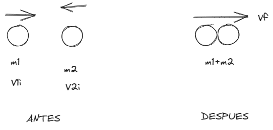
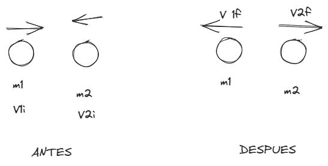
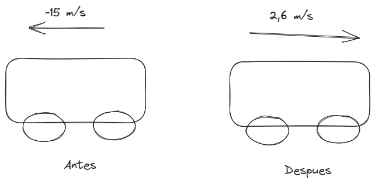
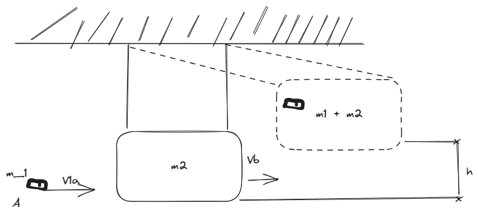

# [[Fisica 1 (Mecanica)]]
	- ## Choque (Colisiones)
		- ### Colisiones perfectamente INELASTICOS
			- Una colision inelastica es aquella en la que la energia cinetica total del sistema NO no es la misma antes y despues de la colicion aun cuando se conserve la cantidad de movimiento del sistema.
			- Considere 2 particulas de una masa m1 y m2 que se mueven con velocidad iniciales V1i y V2i a lo largo de la misma recta, como se ve en la figura:
				- [[draws/2025-06-17-18-10-39.excalidraw]
				- 
				- Las 2 particulas chocan de frente, se quedan pegadas y luego se mueve con velocidad final Vf despues de la colision
				- debido a que la cantidad de movimiento de un sistema aislado se conserva en cualquier colision, podemos decir que la cantidad total de movimiento antes de la colision es igual a la cantidad total de movimiento del sistema combinado despues de la colision
				- |ANTES|DESPUES|
				  |$$(m_1 \times V_{1i}) + (m_2 \times V_{2i}) = 0$$|$$(m_1 + m_2) \times V_f = 0$$|
					- |Si igualamos el sistema|
					  |$$\therefore (m_1 \times V_{1i})+(m_2 \times V_{2i})=(m_1 + m_2) \times V_f$$|
					- $$\boxed{V_f = \frac{m_1 \times V_{1i} + m_2 \times V_{2i}}{(m_1 + m_2)}}$$
			- ### Colisiones perfectamente ELASTICAS
				- Es aquella en la que la energia cinetica total y la cantidad de movimiento del sistema son iguales antes y despues de la colision.
				- Dos particulas de masa $$m_1$$ y $$m_2$$ que se mueven con velocidades iniciales $$V_{1i}$$ y $$V_{2i}$$ a lo largo de la misma recta, como se ve en la figura:
				- [[draws/2025-06-17-18-30-43.excalidraw]
				- 
				- Las 2 particulas chocan de frente y luego se alejan del lugar de la colision con diferentes velocidades $$V_{1f}$$ y $$V_{2f}$$ Si la colision es elastica se conservan tanto la cantidad de movimiento como la energia cinetica del sistema
				- |ANTES|DESPUES|
				  |$$(m_1 \times V_{1i}) + (m_2 \times V_{2i}) = 0$$|$$(m_1 \times V_{1f}) + (m_2 \times V_{2f}) = 0$$|
				- |Si igualamos el sistema|
				  |$$(m_1 \times V_{1i}) + (m_2 \times V_{2i}) = (m_1 \times V_{1f}) + (m_2 \times V_{2f})$$|
				- <ins>Observacion:</ins> Indicamos $$V$$ como positivo si una particula se mueve hacia derecha y negativa si se mueve hacia la izquierda.
				- <ins>Relacionamos entre las energias cineticas</ins>
				  |$$\frac{1}{2} m_1 V_{1i}^2 + \frac{1}{2} m_2 V_{2i}^2 = \frac{1}{2} m_1 V_{1f}^2 + \frac{1}{2} m_2 V_{2f}^2  $$|
				- |Cancelamos la expresion $$\frac{1}{2}$$| Ordenamos|
				  |$$m_1 V_{1i}^2 + m_2 V_{2i}^2 = m_1 V_{1f}^2 + m_2 V_{2f}^2  $$|$$m_1 (V_{1i}^2 - V_{1f}^2) = m_2 (V_{2f}^2 + V_{2i}^2)  $$|
				- Haciendo factorizando con diferencias de cuadrados
				  $$m_1 (V_{1i} - V_{1f})(V_{1i} + V_{1f}) = m_2 (V_{2i} - V_{2f})(V_{2i} + V_{2f}) \text{........ ecuacion 2}$$
				- Ordenando:
				  $$(m_1 V_{1i})-(m_1 V_{1f}) = (m_2 V_{2f})-(m_2 V_{2i})$$
				  $$m_1 (V_{1i} - V_{1f}) = m_2 (V_{2f} - V_{2i})$$
				- Dividirla ecuacion 1 entre la ecuacion 2
				  $$\frac{m_1 (V_{1i} - V_{1f})(V_{1i} + V_{1f})}{m_1 (V_{1i} - V_{1f})} = \frac{m_2 (V_{2f} - V_{2i})(V_{2f} + V_{2i})}{m_1 (V_{2f} - V_{2i})}$$
				- Se cancelan las expresiones comunes
				  $$V_{1i} + V_{1f} = V_{2f} + V_{2i}$$
				  $$V_{1i} - V_{2i} = V_{2f} - V_{1f}$$
				  $$V_{1i} - V_{2i} = -(V_{1f} - V_{2f})$$
			- ### Ejercicios
				- (Que tan buenas son las defensas)
					- Un automovil de 1500 kg de masa choca contra un muro, como se ve en la figura. La velocidad inicial $$V_{i} = -15 \frac{m}{s}$$. La Velocidad Final $$V_f = 2,6 \frac{m}{s}$$. Si el choque dura $$0,15 \text{segundos}$$. Encuentre el impulso debido a este y la fuerza promedio ejercida en el automovil.
						- [[draws/2025-06-17-19-33-50.excalidraw]
						- 
						- [[draws/2025-06-17-19-37-42.excalidraw]]
				- (El Pendulo Balistico)
					- El pendulo balistico es un sistema con el que se mide la velocidad del proyectil que se mueve con rapidez, como una bala. la bala dispara hacia un bloque de madera suspendido de algunos alambras ligeros. la bala es detenida por el bloque y todo el sistema se balancea hasta alcanza la altura H. Puesto que el choque es perfectamente inelastico y el momento se conserva
						- La energia cinetica **DESPUES** del choque es:
							- $$K = \frac{1}{2} (m_1 + m_2) \times V_f^2$$
							  K es la energia cinetica un momento despues del choque
							- Analisis del **ANTES**
							  $$\boxed{V_{1f} = \frac{(m_1 + m_2)}{m_1} \times \squad{2gh}}$$
							- Hallar Vil
							  Masa Bala = 5g
							  Masa Bloque = 1 kg
							  Pendulo Balistico = 5cm
							- **Respuesta 198,9 m/NS**
					- [[draws/2025-06-17-19-44-51.excalidraw]
					- {:height 367, :width 790}
					-
					- ### Solución:
					- #### 1. Energía Cinética Después del Choque
					  
					  La energía cinética *K* después del choque se puede calcular con la fórmula:
					  *K*=21​(*m*1​+*m*2​)*V**f*2​
					  
					  Donde:
					- *m*1​ es la masa de la bala.
					- *m*2​ es la masa del bloque.
					- *V**f*​ es la velocidad final del sistema (bala + bloque) después del choque.
					- #### 2. Análisis Antes del Choque
					  
					  La velocidad final *V*1*f*​ de la bala después del choque se puede calcular con la fórmula:
					  *V*1*f*​=*m*1​(*m*1​+*m*2​)​2*g**h*​
					  
					  Donde:
					- *g* es la aceleración debido a la gravedad (9.8m/s2).
					- *h* es la altura a la que se balancea el sistema después del choque.
					- #### 3. Hallar   *V**i*​   (Velocidad Inicial de la Bala)
					  
					  Dado:
					- Masa de la bala *m*1​=5g=0.005kg
					- Masa del bloque *m*2​=1kg
					- Altura *h*=5cm=0.05m
					  
					  Primero, calculamos *V**f*​ (velocidad final del sistema):
					  *V**f*​=2*g**h*​=2×9.8m/s2×0.05m​=0.98​≈0.99m/s
					  
					  Luego, calculamos *V*1*f*​ (velocidad final de la bala):
					  *V*1*f*​=*m*1​(*m*1​+*m*2​)​×0.99m/s=0.005kg(0.005kg+1kg)​×0.99m/s=0.0051.005​×0.99m/s=201×0.99m/s≈198.99m/s
					- #### 4. Conservación del Momento
					  
					  El momento antes del choque es igual al momento después del choque:
					  *m*1​*V**i*​=(*m*1​+*m*2​)*V**f*​
					  
					  Solving for *V**i*​:
					  *V**i*​=*m*1​(*m*1​+*m*2​)*V**f*​​=0.005kg(0.005kg+1kg)×0.99m/s​=0.0051.005×0.99m/s​=201×0.99m/s≈198.99m/s
					- ### Conclusiones:
					- La velocidad inicial de la bala *V**i*​ es 198.99m/s​
					-
					-
					-
					-
				-
-